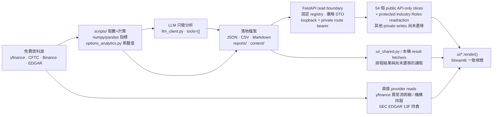

# Quant Radar 使用手冊 — 快速上手指南

> **這是什麼？** Quant Radar 是一套以「**驗證資料 → AI 分析**」為核心的量化雷達儀表板:由程式碼先抓取並驗證真實的免費市場資料(yfinance、CFTC 官方 API、Binance 公開端點、SEC EDGAR…),計算技術指標與選擇權數學,再交給 LLM**只做分析、不做抓取**,最後把美股暴漲股篩選、期權決策、復盤因子驗證、COT 週報、幣圈清單等訊號集中呈現於單一 Streamlit 應用。
>
> ⚠️ **重要免責**:本系統**僅供訊號生成,非投資建議**。所有頁面**唯讀**,對券商(IBKR)**永不下單** — 任何買賣都由你手動執行。側邊欄底部固定標註「僅供訊號生成,非投資建議。Quant Radar — DEoT 多層分析」。

> 📌 **美股期權波段交易者的主流程**:若你想知道每個功能背後由哪些模組搭建、何時使用、哪些入口可收斂,先看 [`docs/options_trader_function_audit.md`](options_trader_function_audit.md)。本手冊保留逐頁操作說明;該文件負責交易流程、工程模組對照與收斂建議。

> 📷 **關於截圖**:每頁截圖內嵌自 `docs/images/<頁面網址>.png`(全 13 頁已附)。若 UI 改版要更新,啟動 `make run` 後重截、覆蓋同名檔即可。

---

## 目錄 (Table of Contents)

- [1. 快速上手](#1-快速上手)
- [2. 導覽地圖](#2-導覽地圖)
- [3. 逐頁說明](#3-逐頁說明)
  - 美股
    - [🌡 暴漲股篩選器 (US Screener)](#-暴漲股篩選器-us-screener)
    - [🚨 選擇權異常流 (Options Flow)](#-選擇權異常流-options-flow)
    - [🎯 期權作戰台 (Options Cockpit)](#-期權作戰台-options-cockpit)
    - [🧮 期權分析 (US Options)](#-期權分析-us-options)
    - [🎲 分析師評級 (Analyst Views)](#-分析師評級-analyst-views)
    - [🏢 機構面板 (Institutions)](#-機構面板-institutions)
    - [🔁 復盤分析 (Retro Analysis)](#-復盤分析-retro-analysis)
    - [🧾 IBKR 對帳 (IBKR Reconcile)](#-ibkr-對帳-ibkr-reconcile)
    - [📑 COT / ES 週報 (US COT)](#-cot--es-週報-us-cot)
    - [🐦 X 社群情緒 — 美股 (US X)](#-x-社群情緒--美股幣圈-x-sentiment)
  - 幣圈
    - [🪙 幣種清單 (Crypto Universe)](#-幣種清單-crypto-universe)
    - [🔍 幣圈篩選 (Crypto Screener)](#-幣圈篩選-crypto-screener)
    - [🐦 X 社群情緒 — 幣圈 (Crypto X)](#-x-社群情緒--美股幣圈-x-sentiment)
  - 系統
    - [👥 關注博主 (Influencers)](#-關注博主-influencers)
    - [⏱ 排程與結果 (Schedules)](#-排程與結果-schedules)
    - [🤖 AI 重點更新 (AI Updates)](#-ai-重點更新-ai-updates)
- [4. 系統架構與資料流](#4-系統架構與資料流)
- [5. 常見問題 FAQ](#5-常見問題-faq)
- [6. 名詞表](#6-名詞表)
- [7. 免責聲明](#7-免責聲明)

---

## 1. 快速上手

本機開發以 **Makefile** 為入口(需先建立 Python 虛擬環境 `.venv`,`PY := .venv/bin/python`,埠位預設 `8501`)。

啟動儀表板:

```bash
make run
```

接著開啟瀏覽器前往 **http://localhost:8501**。預設落地頁為「✅ 今日決策」。

若要驗證目前五十四個 API-only 窄讀取邊界 — 除既有排程、AI 更新、機構、期權、Crypto、Market Thesis、Radar 與 candidate slices 外,現在也包含 Social/Theme/Money Flow presentation、Daily/Playbook/Continuation/COT reports、Knowledge Graph、Watchlist taxonomy、Influencer roster,以及 Sector Rotation 的固定板塊→主題鑽入 — 請用兩個終端機啟動預設拓撲:

Phase 6V–7A 另有一個受保護的 Industry Roles 私有讀取與 mutation pilot。單機開發時先產生一次至少 32 字元的高熵 token，並在 API 與 Streamlit 兩個終端機都 export 同一個值（不要貼到 log、shell history 或 commit）：

```bash
export SURGE_INTERNAL_API_TOKEN="<同一個高熵 token>"
```

未設定 token 時，54 個 public API-only slices 與 `/healthz` 仍可使用，但產業鏈分類的私有 review board 會 fail closed，產生與審核按鈕不會出現。

```bash
# 終端機 1:API，固定供已遷移頁面從 127.0.0.1:8000 讀取，並承接受保護的 Industry Roles action
make api
```

`make API_PORT=8001 api` 可覆寫 API 的獨立啟動埠，僅供單獨除錯；目前 Streamlit API-only clients 固定連 `127.0.0.1:8000`，所以與 dashboard 搭配時必須保留預設 `API_PORT=8000`。

```bash
# 終端機 2:Streamlit
make run
```

可先用 `curl -fsS http://127.0.0.1:8000/healthz` 確認 API,再開啟 **http://localhost:8501**。新增的 Social snapshot 來自 `GET /api/v1/social/intelligence/latest`;Theme Flow board 與 AI read 分別來自 `GET /api/v1/market-context/theme-flow/latest`、`GET /api/v1/market-context/theme-flow/analysis`;Money Flow summary/confirmation 共用 strict `GET /api/v1/market-context/money-flow/latest`；Market Thesis 最新研判、前向驗證與體制摘要分別來自固定的 `/market-thesis/latest`、`/market-thesis/validation` 與 `/market-thesis/regime-history`；Daily Summary 由 `GET /api/v1/reports/daily-summary/latest` 提供。Daily resolver 只選最新合法 `reports/YYYY-MM-DD` 目錄，來源 `report_date` 必須與目錄一致，缺檔或壞檔不回退；公開內容只有日期、bounded regime 與 ticker/verdict references，client cap 為 128 KiB。Playbook 與 Continuation Validation 分別由固定的 `GET /api/v1/reports/playbook-validation/latest`、`GET /api/v1/reports/continuation-validation/latest` 提供；兩者都會移除 blocked reason、producer note、路徑與 provider 細節,Continuation 只公開 bounded 分類、候選原因標籤與 forward-return rows。COT published catalog/detail 分別由 `GET /api/v1/reports/cot` 與 `GET /api/v1/reports/cot/{report_date}` 提供；catalog 最多 520 筆,detail 只接受完整 Markdown/verified pair 並驗證日期、算術、OHLC、stale flag 與 audit timestamp,不回退舊週報。Sector Rotation 定量板塊由 `GET /api/v1/market-context/sector-rotation/latest` 提供；固定板塊→主題鑽入由 `GET /api/v1/market-context/theme-drill` 提供,只公開 parent SPDR ETF 與主題名稱,不含 basket tickers/desc/reps。Oversold 與 Reversal 前向命中率分別由固定的 `GET /api/v1/signals/oversold-reversal/validation` 與 `GET /api/v1/signals/reversal-radar/validation` 提供。兩個 validation endpoint 都只公開保守成熟度與三個 tier 的命中率/Wilson 90% 區間，不公開 EV、excess、equity curve、survivorship/cohort、成本、caveats 或 producer notes；兩者 client cap 都是 32 KiB。Social endpoint 只提供與目前 US/CRYPTO 頁面相符的 persisted snapshot；同 rerun 剛完成的 refresh 結果可直接呈現,legacy X picks 仍是獨立相容 sibling。Theme Flow analysis 只有 validation v8 且 fingerprint 與目前 board 相同才會顯示；舊分析必須用既有按鈕重新產生。Sector Rotation endpoint 只選最新的 `YYYY-MM-DD.json` archive，不會在缺檔或壞檔時回退舊檔或從 Streamlit 叫 live provider；公開欄位不含 macro、leaders/improving、AI read 與 producer status。Money Flow 公開回應不包含 `secid`、`raw_row` 與未使用的細項欄位；Market Thesis regime endpoint 也不包含 2.3 MiB 的 daily/runs/episodes/rules/VIX raw corpus。Agent Reach/X/Codex、COT generation、AI summary、Sector Rotation AI generation 與 ticker-to-sector provider、Theme refresh/status/AI actions、insider provider 都仍走原本本機/Internal 邊界。

Phase 4Q/4R 的分析師候選 grid 與板塊 candidate mapping 共用 strict `GET /api/v1/candidates/scored/feed`；Phase 4S 的美股篩選 scored regime/count/cards 使用獨立的 strict `GET /api/v1/candidates/scored/screener`。這三個頁面的 analyst/sector provider、AI 輪動研判、filtered/Layer 2/DD/report/ledger 與 actions 仍保留原邊界。

這五十四個 API-only slices 固定使用預設埠 `8000`,不會跟隨 Makefile 的埠覆寫。Phase 4T 的 X refresh ranked seed 是第二十個,Phase 4U 的 persisted Social snapshot 是第二十一個,Phase 4V 的 Theme Flow snapshot/analysis presentation 是第二十二個。Phase 4W 建立 strict Money Flow contract；Phase 4X、4Y、4Z 的 Schedules Money Flow summary、standalone 與 embedded Options Cockpit confirmation 是第二十三至第二十五個 **API-only** slices。Phase 5A 的 Schedules Options Flow summary 與 Phase 5B 的 standalone Options Cockpit Options Flow quick picks 是第二十六與第二十七個 **API-only** slices。Phase 5C、5D、5E 的 Schedules Crypto Universe summary、Schedules Theme Flow summary 與 Options Cockpit IV-history presentation 是第二十八至第三十個 **API-only** slices。Phase 5F 的 standalone Cockpit Social quick picks、Phase 5G 的 Market Thesis validation summary 與 Phase 5H 的 regime summary 是第三十一至第三十三個 **API-only** slices。Phase 5I 建立 strict Sector Rotation board contract；Phase 5J 的 standalone quantitative board 與 Phase 5K 的 Stock Checkup sector board 是第三十四至第三十五個 **API-only** slices。Phase 5L 的今日決策 Market Thesis 信任卡是第三十六個；Phase 5M 建立 strict Oversold validation contract,Phase 5N 的 standalone/embedded 前向驗證 presentation 是第三十七個；Phase 5O 的今日決策 Oversold 信任卡是第三十八個；Phase 5P 建立 strict Reversal validation contract,Phase 5Q 的今日決策 Reversal 信任卡是第三十九個；Phase 5R、5S、5T 的今日決策 Reversal latest 候選數、Oversold latest 候選數與 Options Flow table 是第四十至第四十二個 **API-only** slices。Phase 5U 的今日決策 Market Thesis gate 與 Phase 5W 的 Daily Summary gate/opportunity references 是第四十三與第四十四個 **API-only** slices；Phase 5V 建立其 strict Daily Summary contract。Phase 5X 的 Schedules Daily Summary card 與 Phase 5Z 的 Playbook Validation presentation 是第四十五與第四十六個 **API-only** slices；Phase 5Y 建立 strict Playbook Validation contract。Phase 6A–6C 的 Continuation Validation 是第四十七個；Phase 6D 建立 strict COT catalog/detail contract,Phase 6E 的 Schedules COT card 與 Phase 6F 的 COT persisted presentation 是第四十八與第四十九個 **API-only** slices。Phase 6G–6I 的 Knowledge Graph 是第五十個；Phase 6J–6L 的 Watchlist taxonomy、Influencer initial roster 與 X roster quick-pick 是第五十一至第五十三個；Phase 6P–6R 的 Sector Rotation theme drill 是第五十四個 **API-only** slice。它們只遷移命名的窄讀取,不代表複合頁面整頁 API 化。有效 `available=false` 與任何 client failure 都不會繞過 API 改讀已遷移的來源 artifact；Trade State、Social legacy X-picks、embedded quick picks、Sector Rotation AI read/generation、ticker-to-sector provider、Theme refresh/status/actions、reconciliation/ledger、COT/Codex 產生操作與 `momentum_options` strategy provider 仍是明確保留的 local/Internal siblings。Theme drill client cap 為 256 KiB；Continuation client cap 為 4 MiB,COT catalog/detail 分別為 64/512 KiB；Money Flow、Options Flow 與 Theme board 超過 8 MiB、Social 或 IV history 超過 2 MiB、Sector Rotation 或 Theme analysis 超過 512 KiB、Daily Summary、Playbook Validation 或 Market Thesis validation/regime summary 超過 128 KiB,或任一 Reversal/Oversold validation 超過 32 KiB 時同樣 fail soft；Cockpit API state 依既有 15 分鐘 live-provider cache 更新。

既有遷移順序仍維持原驗收定義：Market Thesis latest 是第七個 **API-only** slice；Reversal 與 Oversold persisted snapshots 是第八與第九個 **API-only** slices；Schedules ranked summary、Institutional Holdings scored context、Analytics DB ranked defaults 是第十一至第十三個 **API-only** slices；US Options、Industry Roles、Options Cockpit 的 candidate reads 是第十四至第十六個 **API-only** slices；Analyst Views、Sector Rotation、US Screener 是第十七至第十九個 **API-only** slices。

Docker Compose 會啟動獨立的 `api` 與 `app` 服務。兩個容器共用 API 的 network namespace,所以 Streamlit 仍只連固定的 `127.0.0.1:8000`;FastAPI 不對主機發布 `8000`,也沒有放寬 loopback peer/Host 檢查。外部仍只開放 Streamlit 的 `8501`:

先在 gitignored 的 `.env` 設定 `SURGE_INTERNAL_API_TOKEN=<高熵 token>`；Compose 會把同一個值傳給兩個服務。測試機的 systemd deploy 會自動建立 mode-0600 的 `shared/runtime/internal-api.env`，FastAPI 透過 `LoadCredential` 讀取，Streamlit 讀同一檔案；它不會重用 Codex/X 登入資訊。

```bash
docker compose up --build
```

`app` 會等待 API health check 通過後才啟動。上述五十四個 public slices 在此拓撲全部都是 API-only；Industry Roles 另有 authenticated private read/action pilot。Compose 將 canonical state volume 以 API 可寫、Streamlit 唯讀方式掛載。其他保留的 provider、aggregate 與 mutation siblings 不受這個 health dependency 重新分類。

### 常用 make 指令

| 指令 | 用途 |
|---|---|
| `make run` | 先停掉任何在跑的 dashboard,再以**前景**啟動 Streamlit(看 UI 的主要方式) |
| `make api` | 在 `127.0.0.1:8000` 前景啟動 FastAPI(驗證五十四個 public slices 與 protected Industry Roles action 時需另開一個終端機) |
| `make run-bg` | **背景**啟動,log 寫入 `/tmp/streamlit.log` |
| `make logs` | tail 即時 log |
| `make stop` / `make restart` | 停止 / 重啟 dashboard |
| `make cot` | 本機產生 COT/ES 週報(走 Codex ChatGPT 訂閱額度,免 API key) |
| `make cot-data` | `--no-llm` 乾跑:只抓 + 組裝驗證資料、不呼叫 LLM(測試用) |
| `make candidates-local` | 本機刷新候選:hard filter + deterministic rank,預設不跑 LLM |
| `make candidates-rank-local` | 只重排既有 `filtered_universe.json`,輸出 `ranked_candidates.json` |
| `make candidates-score-local` | 可選 Codex deep check,走 Codex SDK / ChatGPT 訂閱額度 |
| `make test` | 跑 options-analytics / momentum 單元測試 |

> 💡 多數頁面只是「讀檔呈現」,即使對應的 pipeline 尚未跑過,頁面也不會崩潰,而是顯示「尚無資料」並提示你該執行哪個腳本。

### 本機補今日候選

若「今日決策」左側沒有 confirmed picks,先跑快速本機候選池:

```bash
make candidates-local RANK_LIMIT=50
```

這個 target 會先跑 `scripts/01_hard_filter.py`,再跑 `scripts/03_rank_candidates.py`,輸出 `filtered_universe.json` 與 `ranked_candidates.json`。預設不呼叫 Codex,因此適合每日收盤後快速刷新今日候選。

若已經有 `filtered_universe.json`,只想重排 top pool:

```bash
make candidates-rank-local RANK_LIMIT=50
```

若要對 ranked pool 做少量 Codex deep check:

```bash
make candidates-score-local CANDIDATE_LIMIT=3
```

`candidates-score-local` 預設讀 `ranked_candidates.json`,再跑 `scripts/02_llm_score.py --provider codex --resume --rescore-stale-language`,使用 Codex SDK 與已登入的 ChatGPT 訂閱額度。預設採帳號模型;需要固定模型時設定 `CANDIDATE_MODEL` 或 `CODEX_MODEL`。adapter 會拒絕 API-key 登入,避免誤切到 OpenAI Platform 計量付費。它只補 `scored_candidates.json` 的少量 LLM 評分;若既有 LLM 詳情仍是英文,預設會先把舊語言格式的列排入重算。若要產生正式日報與 ledger,還要接著跑 Layer 2/3/報告階段。

也可以直接在「今日決策」頁的 **本機篩選控制台** 操作:

- **完整刷新**:等同 `make candidates-local`,會重抓 universe、hard filter、rank top N,可同時設定 options gate。
- **只重排**:等同 `make candidates-rank-local`,讀既有 `filtered_universe.json`,快速重建 `ranked_candidates.json`。
- **少量 LLM**:等同 `make candidates-score-local`,只對 ranked pool 做少量 Codex deep check;若舊結果仍是英文,會優先重算英文舊列。
- **過篩參數**:可調 `RANK_LIMIT`, `OPTIONS_GATE_LIMIT`, `MIN_AVG_DOLLAR_VOL`, `MIN_MARKET_CAP`, `MIN_PRICE`, `MAX_RET_5D`, `MAX_RET_20D`, `EARNINGS_EXCLUDE_DAYS`, `YF_BATCH_SIZE`, `MIN_DATA_COVERAGE`。
- **篩選紀錄**:讀 `reports/run_status/candidates-local-history.jsonl`,顯示每次 run 的完成時間、ranked 數量與 options gate 數量。

---

## 2. 導覽地圖

側邊欄將頁面分成五個工作流群組:**今日決策 / 市場背景 / 研究驗證 / 資料維護 / 幣圈**。目前 `app.py` 實際註冊 24 個入口;對美股期權波段交易者,預設落地頁就是「✅ 今日決策」。

### 今日決策

| 頁面 | 一句話用途 |
|---|---|
| ✅ **今日決策** | 聚合大盤閘門、信任邊界、篩選器候選、異常流、風控與研究入口的首頁 |
| 🌡 **暴漲股篩選器** | DEoT 多層篩選器:大盤環境 → 篩選漏斗 → Layer1 評分 → Layer2 控制器 → Layer3 盡調 → 績效回溯 |
| 🚨 **選擇權異常流** | EOD 期權量異常排行;提供作戰台與個股總覽跳轉 |
| 🔍 **個股總覽** | 單檔研究樞紐:因子體檢、作戰台、期權分析、板塊、基本面、分析師、機構 |
| 🎯 **期權作戰台** | 單頁期權決策座艙:GO/WAIT/AVOID 判定 + 方向 + IV 環境 + 建議合約 + 損益圖 |
| 📡 **雷達 (風險＋反轉)** | 風險分、反轉分、壓縮基底三讀;持倉風控優先於新進場 |
| 🧾 **IBKR 對帳** | 對帳 Screener 預測 vs 你 IBKR 帳戶真實持倉(唯讀,永不下單) |

### 市場背景

| 頁面 | 一句話用途 |
|---|---|
| 🔄 **熱錢板塊輪動** | 板塊 RRG 與候選所在板塊,用於確認市場主線 |
| 💧 **主題資金流** | 窄主題價量 proxy + Form-4 overlay;方向性參考,非真實主力買賣超 |
| 📑 **COT / ES 週報** | 每週 AI 撰寫的 E-mini S&P 500(ES)期貨 COT 籌碼週報 |
| 🧭 **大盤行情研判** | Tier-1 大盤方向/期程與 forward 驗證;目前探索性、未成熟前不作警報依據 |
| 🐦 **X 社群情緒** | 透過 X 貼文分析博主/關鍵字情緒,並用 Codex web research 掃描博主清單萃取熱門標的 |

### 研究驗證

| 頁面 | 一句話用途 |
|---|---|
| 🔁 **復盤分析** | 由歷史回測逆向重構暴漲前面貌,以 LIFT 驗證哪些評分因子有效/失效/反向 |
| 🔗 **知識網路** | 因子、維度、文獻與驗證狀態的唯讀圖譜 |
| 🧮 **期權分析** | 免費期權鏈分析:異常 call 活動、GEX gamma 代理、波動率微笑、期限結構 |
| 🎲 **分析師評級** | 賣方分析師共識、目標價、升降評與預估修正動態(yfinance 免費資料) |
| 🏢 **機構面板** | 股票→誰持有它、機構→它持有哪些股票;快選目錄與可選籌碼評分脈絡 API-only,13F 有申報延遲 |

### 資料維護

| 頁面 | 一句話用途 |
|---|---|
| 🗂 **自選股分類** | 合併 TradingView / IBKR 清單並依板塊、主題分類;偏資料維護 |
| 🧩 **產業鏈分類** | strict ranked seed + X picks 產生分類建議；approve/reject/defer 仍是本機受控寫入 |
| 👥 **關注博主** | 依分類展示追蹤的 X 博主清單(X 社群情緒頁的單一真實資源) |
| ⏱ **排程與結果** | 檢視自動化排程的時間表與最近一次執行結果 |
| 🤖 **AI 重點更新** | 手動維護的 AI 與市場重點摘要 feed,支援標籤篩選 |

### 幣圈

| 頁面 | 一句話用途 |
|---|---|
| 🪙 **幣種清單** | 幣安 USDT 永續期貨完整名單 + 每日增減 + TradingView 匯出 |
| 🔍 **幣圈篩選** | 鏡像美股篩選器的幣圈版骨架(管線尚未接上,展示計畫版面) |
| 🐦 **X 社群情緒** | 同上,切換為幣圈博主與標的 |

---

## 3. 逐頁說明

### 🌡 暴漲股篩選器 (US Screener)


**功能用途**:實現 DEoT(Dynamic Expert-of-Thought)多層篩選器,把整個股票宇宙逐層收斂為高品質候選股,並提供完整的決策透明度與績效回溯。

**操作流程**

1. 點選左側「🌡 暴漲股篩選器」進入,自動載入最新篩選結果。
2. 側邊欄顯示 6 項管線檔案狀態(✅ 已有資料 / ⬜ 未生成):硬篩選、LLM 評分、引擎控制器、深度盡調、報告、績效帳本。
3. 從側邊欄「報告日期」下拉切換不同掃描日期。
4. 逐一點擊 6 個頁籤:
   - **[0] 🌡 大盤環境** — 市場制度(SPY vs MA、VIX、當日主題、市場警告)
   - **[1] 🔽 篩選管線** — 漏斗圖與各階段通過率
   - **[2] 📊 候選股** — 七維雷達圖、分數表、分析師評級、訊號與風險、進場區間
   - **[3] 🧠 Layer 2** — 引擎控制器的決策樹(BREADTH/DEPTH/TERMINATE)
   - **[4] 🔍 盡調結果** — SEC 10-Q/8-K 盡調(confirmed / downgraded / rejected)
   - **[5] 📈 績效** — 績效帳本、30 日報酬分布(Box Plot)、回測統計
5. 在各頁籤點擊「展開/摺疊」(expander)顯示細節。

**背後運作邏輯**

- **硬篩選** (`filtered_universe.json`):掃描全 US(或 NASDAQ_SP1500),套用 8 項硬指標(SPY vs 50/200DMA、VIX 級別、Minervini Trend Template、MACD、成交量、RSI 背離、反轉型態、$1B+ 市值),資料來自 yfinance 日線+週線。
- **Deterministic Rank** (`ranked_candidates.json`):程式先用 hard-filter 欄位計算 `rank_score 0-100`,權重為技術趨勢 25、動能強度 20、啟動訊號 20、流動性/可交易性 20、過熱風險控制 15。預設 top 50 作為今日候選池。
- **可選 LLM Deep Check** (`scored_candidates.json`):只對 ranked pool 中少量標的沿 7 維度評分 — 技術(0-30)、催化劑(0-16)、情緒(0-13)、籌碼(0-10)、板塊(0-3)、選擇權流(0-20)、分析師(0-8);綜合分數再乘以大盤乘數(VIX/Fed 降權)。**>65 進 Layer 2,≥50 納觀察名單,<50 自動 REJECT**。
- **Layer 2** (`layer2_results.json`):引擎控制器最多迭代 2 層、每層 6 節點,每層決策 BREADTH(橫向對標)/ DEPTH(縱向深掘)/ TERMINATE;輸出透明的分析樹,最終動作 CONTINUE_TO_DD / WATCHLIST / REJECT。
- **Layer 3 盡調** (`dd_results.json`):Dexter DD 技能分析最近 60 天 SEC 10-Q/8-K,輸出關鍵發現、警訊清單、做空論點強度、最終建議。
- **報告** (`reports/<date>/summary.json`):當日投組摘要(regime_summary、ranked_picks、watchlist、主題集中度警告、策略備註)。
- **績效帳本** (`reports/performance_ledger.csv`):每筆已發佈選股的 3/7/14/30/60 日前瞻報酬、+15%/30% 命中旗標、最大回撤。

**小技巧 / 注意事項**

- 若 `options_flow` / `X_velocity` 分數為 0,代表資料缺口,綜合分數應理解為「**下界估計**」。
- 側邊欄檔案狀態只反映「**檔案是否存在**」,不保證內容有效;若顯示 ✅ 但頁內顯示「尚無資料」,可能是空檔/損毀。
- **反例警告**(anti_example_warning)為歷史失敗案例聚類,出現紅框時應強制 SKIP,勿主觀覆蓋。
- 績效欄位顯示「待計算」屬正常:新選股需等每日 20:00 EST 回填前瞻報酬;掃描日期 > 今日則 30 日報酬必為空(無法回測未來)。
- 若 7 維都 >80% 但總分仍 <65,多為大盤乘數被大幅降權(VIX>30 或 Fed 升息),請檢視 regime_context 警告。

---

### 🚨 選擇權異常流 (Options Flow)

**功能用途**:展示收盤後選擇權異常大量排行,包含方向、估權利金、熱度、V/OI 峰值、最活躍履約與標籤,並保留個股期權鏈明細與跨頁代號交接。

**操作流程**

1. 進入「🚨 選擇權異常流」,先確認資料日期、掃描數與偵測筆數。
2. 在「🔥 異常流排行」依來源順序檢視方向、估權利金、V/OI、skew 與標籤;選列後可跳到個股總覽、期權作戰台或雷達。
3. 在「🔎 個股明細」切換代號,查看重點指標與該代號的期權鏈成交量分佈。

**背後運作邏輯**

- 已落地的排行 feed 是第五個 **API-only** slice:每次 Streamlit rerun 只讀取固定的 `GET /api/v1/signals/options-flow/feed`,並以嚴格公開 DTO 保留來源順序與驗證過的 provenance。
- API 回傳有效 `available=false` 時是權威 unavailable;連線、deadline、HTTP status、media type、cache-control、大小或 envelope failure 也只顯示安全 unavailable。Streamlit 程序不再透過 artifact registry 讀取本機排行 feed,下一次 rerun 會立即重試 API。
- 若 shared reader 的 retained decoded-body 累積超過 8 MiB,頁面會安全顯示資料暫時無法使用。這不代表整個程序、壓縮 wire bytes 或 HTTPX decoder 有 8 MiB 硬上限。有效空 feed 仍顯示來源資訊,但不建立芯片、頁籤或即時期權鏈請求。
- 個股明細的即時期權鏈仍是快取 15 分鐘的 yfinance-backed direct provider read,不經這個 feed endpoint。Phase 5A 的 Schedules 摘要、Phase 5B 的 standalone Options Cockpit 快選與 Phase 5T 的今日決策 table 共用同一個 strict feed；Trade State 與其他未選定 Options Flow consumer 仍保留原邊界。

**小技巧 / 注意事項**

- 缺檔、半寫入/壞 JSON、無法讀取或格式錯誤都會由 API 投影成安全 unavailable 狀態,不會讓頁面 crash,也不會把 provider/raw 欄位帶進 UI。
- 異常大量反映成交量偏斜,不等於買賣方主動性或方向預測;真正的逐筆 sweep/暗池仍需付費資料源。

---

### 🎯 期權作戰台 (Options Cockpit)


**功能用途**:在單一頁面快速評估一檔標的是否符合期權進場條件 — 判定(GO/WAIT/AVOID)→ 方向偏好 → IV 波動環境 → 價格圖表 → 建議合約與損益圖 → 進場檢查清單。唯讀決策支援,基於真實 Black-Scholes 定價。

**操作流程**

1. 在文字欄輸入美股代號(如 NVDA),按「分析」。
2. 檢視頂部 Verdict 警示(綠 GO / 黃 WAIT / 紅 AVOID)與 4 項背景原因。
3. 左欄「方向偏好」:趨勢+RVOL、Call/Put 量比、是否站上 VWAP、是否突破 20 日壓力。
4. 右欄「波動環境」:IV Rank、ATM IV、已實現波動、IV 溢價/折扣。
5. 若 DTE 內有財報 → 顯示紅色 IV crush 警示。
6. 查看「價格‧布林‧VWAP‧預期波動錐」靜態圖,或切換互動 TradingView 圖。
7. 左欄「建議合約」:Δ0.3–0.4 甜蜜點 call(履約價、到期、希臘值、權利金、損益兩平、流動性)。
8. 右欄「損益圖」:選「單買 Call」或「牛市買權價差」,拉時間軸看時間衰減,查 POP、最大風險、最大獲利。
9. 展開「進場檢查清單」(10 項條件 ✅/❌ + 進度條)、「期權鏈量分佈」、「IV 走勢」。

**背後運作邏輯**

- 價格與技術指標:yfinance ~15 分延遲日線,算 20/50/200 日線、布林(20,2)、VWAP(20d)、RVOL、ATR、RSI、20 日壓力。
- 期權鏈:取最接近 2–3 週 DTE(10–25 天)到期月份。
- 希臘值與權利金:自製 Black-Scholes(`options_analytics.py`,全 app 唯一數學源)。
- IV Rank/百分位:`iv_history.py` 每日 ATM IV 累積快照(需滿 **40 天**才算真實百分位,未滿前以已實現波動代理並標「累積中」)。
- Cockpit 自己顯示的 IV 歷史與 Rank/Percentile 每個未命中 15 分鐘 cache 的 live-provider 執行只呼叫一次 strict `GET /api/v1/options/iv-history/{ticker}`,再把已驗證 points 交給 `iv_history.py` 的純計算函式。有效空資料、authoritative unavailable、invalid ticker 與 client failure 都不會回讀本機 IV JSON；只有 provider 明確標成 `realized_vol_proxy` 的累積期代理可繼續顯示。`momentum_options` 的 strategy verdict/checklist 與既有記錄動作是保留的 provider sibling,不屬於這個窄 presentation slice。
- 財報風險:yfinance calendar / earnings_dates 判斷是否在 DTE 內。
- 大盤風情:從 `scored_candidates.json` 的 regime_context 讀(SPY > 200DMA + VIX < 25 = risk-on)。
- 候選快選中的 Social、今日篩選器與異常流每次 standalone rerun 各呼叫一次 strict fixed client；Social 只採 US snapshot,不再由 Cockpit 讀本機 Social latest。有效空資料、其他市場、unavailable 或 client failure 時,獨立 legacy `reports/x_influencer_picks.json` 仍可相容顯示；IBKR 與另兩個 API 來源維持獨立。REJECT-only 日仍標成**非推薦**；embedded `render_for()` 不會載入快選。
- standalone 與 embedded 的「外部確認」在各自實際 render 時只呼叫一次 strict Money Flow latest；authoritative unavailable 與 client failure 顯示不同安全提示,不會回讀本機 Money Flow。Stock Checkup 仍以 lazy tab 控制 embedded 載入時機,EDGAR 按鈕與 live options chain 不受影響。
- **GO 三高牆**:IV 真實且 < 30%、財報已知且 > DTE、合約可成交(雙邊報價、價差 ≤12%)。任一失敗即被阻止為 WAIT。

**小技巧 / 注意事項**

- ~15 分延遲資料,適合**收盤後掃描次日機會**,不適 0DTE 盤中。
- 即時資料抓不到時自動切到 deterministic mock(以代號 MD5 為種子),畫面與計算仍為真實,可重試載入真實鏈。
- 高 IV 環境改用「牛市買權價差」可降低虧損上限;低 IV 環境「單買 Call」乘數更大但無下檔保護。
- POP 為**零漂移**假設下的保守機率估計,不含預期方向。
- 預期波動錐 ±1σ 假設 IV 恆定;財報後 IV crush 會使圖形失效(故強制財報警示)。

---

### 🧮 期權分析 (US Options)


**功能用途**:免費美股期權鏈分析,涵蓋異常 call 活動(Dim 6a)與 GEX gamma 代理(Dim 6d),協助判斷期權流向偏好與波動率結構。

**操作流程**

1. 在「個股期權」頁籤輸入代號(NVDA / AMD),按「分析期權」。
2. 觀看頂部「流向偏好」與「IV Rank」晶片(綠/黃/紅)。
3. 檢視 Call/Put 量比、V/OI、價外 call 成交量等 4 項指標卡。
4. 切換「長條 / 熱圖」看履約價分佈的成交量/OI。
5. 點「📐 載入 波動率微笑 / 期限結構」(多到期,較慢,快取 15 分鐘)。
6. 觀察微笑(左側 put IV 翹起 = 下檔避險需求)與期限結構(近月 > 遠月 = backwardation)。
7. 看「最活躍 call 履約價」表格、展開「維度分數」、回「當日候選排行」依判定/IV-Rank 排序。

**背後運作邏輯**

- 取 yfinance 最接近 **30 DTE** 主鏈 + 最近週選。
- **Dim 6a(滿分 8)**:cp_ratio >1.2 偏多、Put/Call >1.8 直接 -3 分;V/OI ≥2.0 為異常活躍。
- **Dim 6d(滿分 3)**:現價±5% 內 put OI > call OI×1.5 = 負 gamma 代理;偵測 call wall。
- **免費缺口**:6b Sweeps/Blocks、6c 暗池需 Unusual Whales 付費資料,**永遠評 0**(免費上限約 11/20)。
- IV 反演:用 `options_analytics.py` 以二分法從 mid 價格反推 IV(避免 yfinance 原生 IV 欄垃圾)。
- 頂端的單一標的 IV Rank 晶片是第四個 **API-only** slice:每次 rerun 只讀固定的 `GET /api/v1/options/iv-history/{ticker}`,再以 `iv_history.py` 的純計算函式套用相同的 40/252 日規則。有效 `available=false` 與連線、deadline、HTTP status、header、大小或回應契約等 client failure 都只顯示安全 unavailable,不會由 Streamlit 程序改讀本機 IV JSON;下一次 rerun 會立即重試 API,完整即時期權鏈仍可使用。
- 「當日候選排行」每次 rerun 只讀一次 strict `GET /api/v1/candidates/scored/feed`,不再由 Streamlit 讀本機 scored artifact；其中每個候選的 IV-Rank/sparkline 仍直接來自本機 `iv_history.py`(需 ≥40 天快照),因此不會逐列呼叫 API。Phase 5E 只遷移 Options Cockpit 自己的單標的 IV-history presentation,不改變這個候選 grid。

**小技巧 / 注意事項**

- 「流向偏好」由當日成交量推導,**非方向預測**,需搭配技術面與新聞。
- **OI 常於盤中回傳 0**(OCC 每日收盤後才更新),盤中以成交量為主;準確 OI 牆建議 3–4pm 後或隔日查看。
- 波動率微笑載入較慢(多到期 yfinance 呼叫),首次點擊後快取 15 分鐘,勿頻繁點擊。
- V/OI >2 只表異常活躍,未必預示方向(大戶可能雙邊掃單或避險)。

---

### 🎲 分析師評級 (Analyst Views)


**功能用途**:展示賣方分析師共識評級、目標價、升降評與預估修正動態,作為決策參考。分為候選股排行榜(多代碼)與個股明細(單代碼)。

**操作流程**

1. 進「美股 → 分析師評級 🎲」。
2. 上方「📋 候選股分析師排行」自動展示管線評過的候選股(共識、家數、目標上行%、近 30 天淨上修)。
3. 點表格列或在「代號」欄輸入任意美股代碼(不限候選股)。
4. 下方「🔎 個股明細」自動更新:共識評等、平均評分(1~5)、目標價範圍、評等分布圖、近期升降評、預估修正。

**背後運作邏輯**

- 全部資料來自 yfinance 免費 API(Yahoo 聚合),**非 LLM 生成**,遵循「驗證資料進 AI」原則。
- 來源 `scripts/analyst_free.py → gather_analyst_views()`,快取 TTL **6 小時**,任何抓取失敗回 None **永不拋例外**。
- 淨修正值 = Σ(上修) − Σ(下修),正值 = 上調動能(Dimension 7c 領先子訊號)。
- 排行排序:判定優先(綠 STRONG_BUY/BUY/NEEDS_LAYER_2 → 黃 → 紅)→ 再按目標上行%。
- Phase 4Q 起,排行榜候選來源每次 rerun 只讀一次 strict `GET /api/v1/candidates/scored/feed`；逐檔與預設明細仍走本機快取的 analyst provider,任意代號查詢與嵌入式明細不依賴候選 feed。

**小技巧 / 注意事項**

- 排行表為空時,先確認管線已執行(GitHub Actions `workflow_dispatch` 選 `screener`,或本機依序 `python scripts/01_hard_filter.py` → `python scripts/02_llm_score.py`)。
- 輸入代碼自動 `.upper().strip()`,無需手動大寫。
- 近期升降評表最多 8 筆;某區塊無資料會自動隱藏。
- 「無分析師資料」可能因新股覆蓋率低、公司規模小,或 Yahoo 源暫時故障。

---

### 🏢 機構面板 (Institutions)

**功能用途**:提供兩個互補的研究視角:「股票 → 誰持有它」查看單一股票的機構持有概況;「機構 → 它持有什麼」依 SEC 13F 查看投資管理機構的申報組合。13F 是季度延遲申報資料,不代表即時持倉。

**操作流程**

1. 進入「研究驗證 → 🏢 機構面板」;預設是「機構持股 · 股票 → 誰持有它」,這個子頁不會預先呼叫投資大戶目錄 API。
2. 切到「機構持倉 · 機構 → 它持有什麼」,從來源順序不變的「投資大戶快選」挑選機構,或直接輸入純數字 CIK。手動 CIK 永遠優先。
3. 查看資料季底、申報日、距今天數、持股檔數、申報總市值與前 100 筆持倉。申報延遲會以醒目提示顯示。

**背後運作邏輯**

- 只有 `content/funds.json` 投影出的**快選目錄**是第三個 **API-only** slice:Streamlit 每次 rerun 只讀固定的 `GET /api/v1/institutions/funds`,並以嚴格 `FundCatalogData` 契約保留顯示名稱、CIK、備註與來源順序。維護者 `_note` 不會進入公開回應。
- API 回傳有效的 `available=false`,或發生連線、HTTP、header、大小、envelope 契約等 client failure 時,都只呈現安全的 unavailable 狀態;Streamlit 不再改讀本機目錄。快選會停用,下一次 rerun 會立即重試 API,手動 CIK 欄位仍可查詢。
- 快選會把目錄提供的 CIK 原字串交給 SEC 查詢,同時在 spinner、失敗訊息與必要的名稱 fallback 保留友善機構名稱;手動 CIK 的顯示結果不會被快選名稱覆蓋。
- 這是**部分邊界遷移**。快選之後的 13F 持倉仍由 `scripts/edgar_13f.py` 直接呼叫 SEC EDGAR;預設「股票 → 誰持有它」仍由 yfinance-backed provider 取得。兩者都不是 FastAPI endpoint,provider 的成功快取與失敗後重試行為也沒有改變。

**小技巧 / 注意事項**

- 若 API 快選目錄無法使用,仍可在「或輸入 CIK」輸入例如 `1067983`;目錄故障不會讓整個持倉頁 crash。
- 13F 只列申報的美股長部位與部分選擇權,不含空單、現金、海外或非 13(f) 證券,且原始資料只有 CUSIP / 公司名,沒有股票代號。
- 營運公司通常不是 13F 投資管理機構;輸入 Apple、NVIDIA 等公司的 CIK 不會得到基金式持倉組合。

---

### 🔁 復盤分析 (Retro Analysis)


**功能用途**:由歷史回測挖出真正暴漲過的美股,逆向重構其暴漲前的技術/板塊面貌,以 LIFT 倍數驗證系統評分指標中哪些有效、失效、反向,供交易員手動調整策略權重(**讀寫分離**:本頁純展示)。

**操作流程**

1. 先依序執行復盤管道(嚴格順序):
   ```
   python scripts/retro_surge_label.py --universe sp1500 --lookback-days 730
   python scripts/retro_reconstruct.py
   python scripts/retro_factor_lift.py
   python scripts/retro_report.py --provider auto
   ```
2. **「暴漲事件」**標籤:看掃描摘要、選門檻(+30%/20d、+40%/40d、+50%/60d)、依漲幅排序的事件表、嵌入 TradingView 看圖。
3. **「因子驗證」**標籤:看水平條狀圖(每條 = 一子因子的 LIFT 倍數,虛線標 1.0),依判定染色(綠驗證/藍微弱/灰雜訊/橙反向);展開「Phase 2 · 六維前向驗證」。
4. **「AI建議」**標籤:看 AI 總結與三欄分類(✅ 已驗證 / ➖ 雜訊 / 🔄 反向)、覆蓋缺口、建議變更。
5. 頂端 validation lane 可切到 **「Playbook 驗證」** 或 **「續漲強者」**。Playbook lane 每次 rerun 只讀一次 strict API summary；Continuation lane 保留既有本機讀取。

**背後運作邏輯**

- **暴漲事件**:`retro_surge_label.py` 用調整收盤價偵測過去 2 年非重疊暴漲事件;T0 定義為暴漲啟動的谷底(峰值區間內最低點),以對齊篩選器進場時刻。
- **特徵重構**:`retro_reconstruct.py` 在「確認日」(T0 後首個 +7% 日)重建 Dim1 技術 + Dim5 板塊特徵,用**未調整**收盤價以匹配即時引擎。
- **LIFT 計算**:`retro_factor_lift.py` 對照隨機抽樣(排除暴漲視窗 ±90 日),**LIFT = P(因子|暴漲) / P(因子|隨機)**。判定門檻:VALIDATED(≥1.5 且支持≥20)/ WEAK(1.1–1.5)/ NOISE(0.9–1.1)/ CONTRARIAN(<0.9)/ INSUFFICIENT(支持<5)。90% CI 由 1000 次 bootstrap。
- **AI 報告**:`retro_report.py` 把 LIFT 表餵 Codex,產出分類與建議 JSON,**完全讀寫分離**,交易員手動編輯 `system_prompts/01_surge_screener_prompt.md`。
- **Playbook 驗證**:Phase 5Y/5Z 使用固定 `GET /api/v1/reports/playbook-validation/latest`。公開 DTO 只含狀態、成熟度計數與 bounded playbook/factor summary；blocked reason、outcome count、decision/outcome rows、路徑與 provider 細節維持 private。有效 unavailable 或任何 bounded client failure 只顯示安全狀態，不會由 Streamlit 改讀本機 `latest.json`。

**小技巧 / 注意事項**

- 暴漲事件 < 30 時出現「樣本偏小」警告,結論僅供方向參考;建議回看 ≥ 2 年累積 30–50 事件。
- **LIFT ≠ P(surge|factor)**;表中「精準 LIFT」(precision_lift)更接近投資決策的相關數字。
- **存活偏差不可消除**:已下市暴漲股遭遺漏 → 實際預測力被保守低估,解讀時打折。
- Dim2/Dim4 需另跑 `retro_edgar_backfill.py`;Dim3/Dim6 無免費歷史,需 Phase 2 前向累積。
- 所有建議**不自動套用**,需人工 commit。

---

### 🧾 IBKR 對帳 (IBKR Reconcile)


**功能用途**:對帳 Screener Ledger 預測與你 IBKR 帳戶真實持倉,以三視角呈現:已對帳、Ledger 未持有、持有但未追蹤。**嚴格唯讀,永不下單**。

**操作流程**

1. 點「🧾 IBKR 對帳」進入。首次會提示「尚無對帳資料」。
2. 本機開 IBKR Gateway 或 TWS(啟用 API),執行 `python scripts/ibkr_client.py reconcile`,或按頁面藍色「↻ 從 IBKR 重新對帳」(無訂單風險,約 10–15 秒)。
3. 頂部三 Metric:合計未實現 P&L、已對帳檔數、持有但未追蹤檔數。
4. 向下查看三區塊:「✅ 在 ledger 且持有」、「📋 screener 有建議、未持有」、「🔎 你持有、screener 未追蹤」。

**背後運作邏輯**

- 資料源:`reports/performance_ledger.csv`(日更)+ 即時 `ib_async` 連線 IBKR(`readonly=True`)讀取 `portfolio()` 與 `reqPnL`;結果寫 `reports/reconciliation.json`(Gitignore,本機限定)。
- 三向分類:matched / ledger_not_held / held_not_in_ledger。
- 選權成本由 per-contract(premium×100)除以 multiplier 轉為 **per-share**,使成本與現價可比;`return_pct = unrealizedPnL / cost_basis × 100`。
- 連線埠位嘗試序:7497(TWS paper)→ 4002(Gateway paper)→ 7496(TWS live)→ 4001(Gateway live),可用 `IBKR_PORT` 覆蓋。

**小技巧 / 注意事項**

- 前提:本機 `pip install -r requirements-ibkr.txt` + Gateway/TWS 啟用 API(Configure > API > Settings)。
- 雲端/CI 未裝 `ib_async`,故此功能**本機限定**,「重新對帳」按鈕在雲端自動停用。
- 「已對帳」的建議區與 30d 預期為**掃描時的靜態數據**,不即時更新。
- 「持有未追蹤」通常代表手動下單或 Screener 已放棄追蹤的舊部位,值得重新評估。
- P&L 著色:>0 綠、<0 紅、=0 灰;缺值顯示「—」。

---

### 📑 COT / ES 週報 (US COT)


**功能用途**:每週展示 AI 撰寫的 E-mini S&P 500(ES)期貨 COT 籌碼週報,涵蓋籌碼結構、機構博弈、交易策略、風險提示四大板塊。

**操作流程**

1. 進「📑 COT / ES 週報」。
2. 點「🔄 產生本週報告」(平時由週五 CI 自動執行;手動需完成 Codex ChatGPT 登入)。
3. 若見「⚠️ ES=F 價格無法驗證,未產生報告(反幻覺保護)」需待資料更新後重試。
4. 成功後在「報告(週五日期)」選框選日期。
5. 看三指標卡(ES 週五收盤、COT as-of 週二、週二→週五點數變化)。
6. 展開「🔍 已驗證資料明細」查 JSON;點四大標籤閱讀報告。

**背後運作邏輯**

- 資料蒐集(`scripts/cot_es.py`):CFTC 公開 API(gpe5-46if,TFF futures-only)抓 Asset Managers / Leveraged Funds 淨部位與週變化 + OI;yfinance 抓 ES=F COT-week 週五 OHLC。
- **反幻覺閘道**:若 yfinance 無法提供該週五確切收盤,**直接拋錯中止**,絕不退而用前一日或任意日期。
- 組裝 `verified.json`(cot + price + tuesday_vs_friday + 時間戳),交給 Codex 依 `system_prompts/07_cot_es_analyst_prompt.md` 撰寫;一般 LLM 呼叫會停用 web search。
- **原子性寫入**:先寫 `verified.json` 後寫 `.md`,`os.replace()` 確保不脫鉤、不留半寫狀態。
- Phase 6D–6F 只把**既有週報的 catalog/detail 顯示**改為 loopback API-only；Streamlit 不再列舉或讀取 `reports/cot`。Codex 認證、CFTC/yfinance 擷取與 `scripts/cot_es.py` 寫入仍是本機 mutation sibling。API 回傳 Markdown 前要求完整 verified sidecar,前端再移除外部連結/圖片目標並 escape raw HTML。

**小技巧 / 注意事項**

- 手動觸發需先執行 `codex login`(或頁面 device login)並以 ChatGPT 訂閱登入;價格驗證失敗仍會報 `PriceUnverified`。
- 稽核面板的 `verified.json` 是報告**唯一事實來源**;對數字有疑問請展開 JSON,而非依賴 AI 文案。
- 顏色編碼:綠 = 期間上漲、紅 = 期間下跌(與市場方向同義,與投機盤持倉方向無關)。
- COT 數據截至週二,交付時通常已逾 5–7 天;>9 天會顯示「⚠️ COT 報告偏舊」。
- ES 每點 $50,日內常逾百點,單筆風險建議 ≤ 帳戶 1–2%。

---

### 🐦 X 社群情緒 — 美股/幣圈 (X Sentiment)


> 美股路徑 `/us-x`、幣圈路徑 `/crypto-x`,版面相同,僅切換博主清單與標的。

**功能用途**:以 free-first social intelligence 流程整合社群發現與免費熱度基線。Agent Reach 可提供 ticker discovery；StockTwits 驗證單 ticker retail sentiment；ApeWisdom 提供 Reddit/WSB crowd heat baseline。需要 LLM 的博主研究統一走 Codex SDK / ChatGPT 訂閱。

**操作流程**

1. 進「X 社群情緒」,選市場分組(美股/幣圈)。
2. **單帳號/關鍵字**:選分析模式(「博主帳號」從清單選或自訂輸入;「關鍵字/代號」輸入 $NVDA、BTC)。
3. 用「抓取貼文數」滑桿(5–50,預設 20),按「分析」。
4. 看「整體情緒」(🟢/🟡/🔴)、情緒分數(-1.0~1.0)、摘要、主題標籤、代表貼文;展開「原始貼文」。
5. **博主雷達**分頁:持久化 Social snapshot 固定從 `GET /api/v1/social/intelligence/latest` 讀取,只採用符合目前 US/CRYPTO 市場的快照；缺失或服務失敗時,獨立的 legacy `reports/x_influencer_picks.json` 相容來源仍可顯示。點「↻ 更新 free-first 社群快照」會用 Agent Reach / 免費熱度來源更新；「Codex 博主研究重跑」使用已登入的 ChatGPT 訂閱。
6. 看 Ticker 候選表(提及人數、傾向、信心)、各博主重點、citations。

**背後運作邏輯**

- 單帳號爬取:有 `X_BEARER_TOKEN` 時先用 X API v2(paid optional);沒有 token 或官方 API 失敗時,博主帳號會改用 Agent Reach `user-posts` fallback。關鍵字/全網搜尋目前仍需 X API,直到接上 Agent Reach `twitter search`。情緒分析用 Codex `LLMClient`(預設採帳號模型),輸出 JSON(overall_sentiment / sentiment_score / summary / key_themes / highlights / stance)。
- 博主雷達:主路徑是 `scripts/social_intelligence.py` 產生 free-first snapshot,整合 Agent Reach ticker discovery、StockTwits/ApeWisdom baseline、strict ranked API seed 與本機期權驗證；持久化 presentation 再由 Social API 公開 allowlisted fields。選配重跑仍由 `scripts/x_influencers.py` 透過 Codex SDK web search 研究名冊內博主。
- **無害設計**:Codex thread 為唯讀、禁止 shell/hooks/apps/多代理;所有 ticker/傾向皆須附 citations,找不到公開索引貼文時必須標示 inactive,不得臆測。

**小技巧 / 注意事項**

- **認證**:X API 原始貼文需 `X_BEARER_TOKEN`(paid optional);所有情緒與博主研究 LLM 均需 Codex ChatGPT 訂閱登入(否則降級顯示原始貼文或既有快照)。
- **Agent Reach fallback**:在「Agent Reach 狀態 / Cookie 更新指引」按「開啟測試機 X 登入視窗」,於 noVNC / 測試機桌面完成 X 登入後按「登入完成，更新 Agent Reach Cookie」。平台只把 `auth_token` / `ct0` 寫入測試機 `~/.agent-reach/config.yaml`,不在 UI 顯示明文;之後 `scripts/agent_reach_social_bridge.py` 會自動讀取並注入 `twitter-cli`,服務只需固定設定 `AGENT_REACH_COMMAND`。
- 社群情報快照可跑 `python scripts/social_intelligence.py --market US`;forward validation 可跑 `python scripts/social_intelligence_outcomes.py`。
- 博主雷達舊相容輸出仍是 `reports/x_influencer_picks.json`,之後可離線查看快取。
- 自訂博主加進快選:在「關注博主」頁新增/編輯。預設種子檔是 `content/influencers.json`;正式運行讀寫 `SURGE_INFLUENCERS_PATH`(測試機為 shared 目錄,Docker 為 volume)。
- 單帳號的關注博主快選每次 rerun 只讀固定的 `GET /api/v1/social/influencers`;API 失敗時仍可手動輸入 handle,不會由 Streamlit 改讀本機 roster。即時貼文與 Codex 分析仍走原本的 provider/auth 路徑。
- 單次 Codex 博主研究上限 20 handle,超過自動截斷並警告。

---

### 🪙 幣種清單 (Crypto Universe)


**功能用途**:顯示幣安 USDT 永續期貨(USDT.P)交易對完整名單,突顯與前一日增減,並提供 TradingView 匯入檔。

**操作流程**

1. 在「幣圈」分組點「🪙 幣種清單」。
2. 頂部三卡:目前合約數、➕ 今日新增、➖ 今日下架。
3. 中部兩欄表格看新增(🟢)/下架(🔴)。
4. 在「完整清單」點「⬇️ 匯出 TV」下載 `tradingview_watchlist.txt`。
5. 在 TradingView → Watchlist → Import list 一鍵匯入。

**背後運作邏輯**

- Streamlit 每次 rerun 只讀固定的 `GET /api/v1/crypto/universe`;API 以嚴格公開 DTO 投影 `scripts/crypto_universe.py` 每日產生的 `reports/crypto/universe_latest.json`。
- 資料源:幣安公開 `fapi/v1/exchangeInfo`(**無需 API Key**),篩 PERPETUAL + USDT + TRADING。
- 與前一日快照比對差集:`added = 今日 − 前日`、`removed = 前日 − 今日`。
- TradingView 格式由驗證後 DTO 的 `tv_symbol` 即時衍生,每行 `BINANCE:SYMBOL.P`;公開回應不包含私有 `fetch_error` 或重複的原始 `symbols` 欄位。**100% 來自交易所端點,無 LLM,無幻覺**。

**小技巧 / 注意事項**

- 報告日期與實時可能有一日延遲;需最新可本機跑 `python scripts/crypto_universe.py`。
- 首次執行無對比基準(added/removed 為空),第二日起才顯示增減。
- 這是第六個 **API-only** slice,也是繼 AI Updates 後第二個完整頁面 boundary。有效 `available=false` 與連線、deadline、HTTP status、header、大小或回應契約等 client failure 都只顯示安全 unavailable,不會由 Streamlit 程序讀本機 JSON/TXT;下一次 rerun 會重新嘗試 API。

---

### 🔍 幣圈篩選 (Crypto Screener)


**功能用途**:幣圈信號篩選中樞,鏡像美股篩選器架構。**目前管線尚未接上**,頁面展示計畫中的完整功能骨架與資料源。

**操作流程**

1. 在「幣圈」分組點「🔍 幣圈篩選」。
2. 若 `crypto_scored.json` 已存在 → 自動渲染評分結果。
3. 若未接上(目前狀態)→ 顯示「幣圈資料管線尚未接上」,並提供連至「🪙 查看幣種清單」的導航卡。
4. 向下滾動看「規劃中的版面(鏡像美股)」5 大模組與「規劃中的資料源」。

**背後運作邏輯**

- 設計為「鏡像美股篩選器」,評分結構沿用 `scored_candidates.json` 格式。
- 讀 `crypto_scored.json`(repo 根目錄);若不存在,`load_json()` 回 None,頁面進「預覽模式」(不拋錯)。
- 規劃資料源:CoinGecko / Binance FAPI(已用)、Glassnode / Dune / Nansen(需 API key)、Fear & Greed、資金費率。

**小技巧 / 注意事項**

- 目前為「**骨架就位、資料待接**」,上線時間取決於上游評分管線進度。
- 一旦評分管線開始輸出 `crypto_scored.json`,頁面**自動偵測**並開始渲染,無需重新部署。
- 純唯讀,無篩選表單或參數調整。

---

### 🔗 知識網路 (Knowledge Graph)

**功能用途**:把 `knowledge/` 內的維度、因子、文獻與驗證關係呈現成唯讀圖譜。

**背後運作邏輯**

- Streamlit 每次 rerun 只讀固定的 `GET /api/v1/knowledge/graph`。API 以目錄、entry、Markdown 數量、單檔與總位元組上限做一次有界編譯；symlink、壞 UTF-8、duplicate ID、dangling edge 或超限資料都進安全 unavailable。
- 公開節點不含 path、URL、正文、frontmatter、tags 或檔名；頁面也不再顯示主機上的絕對 vault path。
- API unavailable 或 client failure 不會觸發 Streamlit 本機掃描；下一次 rerun 會立即重試。Obsidian 仍可直接開 repository 的 `knowledge/` vault，既有 ingest/sync/tag writer 不受影響。

---

### 🗂 自選股分類的主題目錄

- 公開主題軸每次頁面 rerun 只讀固定的 `GET /api/v1/watchlists/theme-taxonomy`，保留來源順序並省略維護者 `_note`。
- taxonomy API 暫時不可用時，板塊分類、TradingView 清單與 IBKR 唯讀來源仍可使用；LLM 主題分類會停用，且不會回讀 `content/themes.json`。
- TradingView 上傳/存檔、IBKR reconciliation、sector/yfinance 與 Codex 分類 provider 都維持原本本機邊界。

---

### 🧩 產業鏈分類 (Industry Roles)

**功能用途**:以 ranked candidates 與 X picks 產生產業角色建議，供單一私有主機的 operator 核准、拒絕或延後。

**背後運作邏輯**

- 頁面初始 taxonomy 名稱、已核准 assignment 與 suggestions 只讀固定的 `GET /api/v1/private/industry-roles/review-board`，可用狀態同時帶回 strong ETag；Streamlit 不再直接讀三個來源檔。
- 除 loopback peer/Host 檢查外，該 route 必須收到 `Authorization: Bearer` 的內部服務憑證。這個 token 只代表 Streamlit workload；私有主機的外圍存取控制才代表唯一人類 operator，Codex/X 登入不能代替它。
- DTO 只保留 UI 需要的角色 id/name、assignment 與 suggestion 欄位；taxonomy 描述/keywords/examples、root note、已核准 evidence/reviewer、路徑、provider 與 credential 都不回傳。client 上限為 4 MiB，並要求 `Cache-Control: no-store`。
- 尚未建立 canonical state 是合法且不落盤的 revision-zero 空狀態；taxonomy 缺少、canonical state 損壞、credential 未設定/不一致，或任何 client failure 都會停用整個 board 與產生/審核操作，不做本機 fallback。自動 legacy fallback 已由 R1 移除，即使舊檔存在也不會讀取。
- 「重新產生建議」及 approve/reject/defer 統一送到 `POST /api/v1/private/industry-roles/review-board/actions`。每個操作帶目前 ETag 的 `If-Match` 與新的 `Idempotency-Key`；client 只送一次、不自動 retry。stale state 會要求重新載入。
- canonical `reports/industry_roles/review-state.json` 以單一 revision 原子提交 overrides、suggestions、雜湊後 receipt 與 audit，並保留 `.bak` 供明確 restore。systemd 只開放 API 寫入 shared state 路徑，Streamlit 為 read-only；排程產生建議也共用同一把 lock。
- Money Flow 與 Universe Refresh 透過 canonical-only projection 取得 approved tickers。canonical 損壞時只省略這個 supplemental ticker 來源，保留其他來源且不回退到 stale legacy。
- 維運檢查使用 `.venv/bin/python scripts/industry_role_admin.py status --require-canonical`。R3 已移除 `export-legacy`；`restore-backup` 仍預設只 preview。restore 若另行授權，還需帶 preview/status 的 exact `--expected-etag`，canonical 已損壞時則明確使用 `--allow-invalid-current`。
- dated Phase 7I evidence decision gate 為 `READY`，自動 legacy fallback 已由 R1 移除；R2 自然排程觀察於 2026-08-15 通過後，deployment owner 另行授權 R3。R3 僅退休 export/manifest 程式介面與檔名 allowance，不會建立、封存、移動、改寫、截斷或刪除任何 runtime legacy 檔案。

---

### 👥 關注博主 (Influencers)


**功能用途**:依分類展示與維護追蹤的 X 博主名單。此清單為**單一真實資源**,同時被「X 社群情緒」頁的快速選單引用。

**操作流程**

1. 側邊欄「系統」→「👥 關注博主」。
2. 預設展示所有市場;用上方「市場」單選按鈕(全部/US/CRYPTO)篩選。
3. 統計更新為「X 位博主 / Y 個分類」。
4. 以分類分組查看卡片,點藍色「@帳號」開啟其 X 個人頁。

**背後運作邏輯**

- 頁面初始清單每次 rerun 只讀固定的 `GET /api/v1/social/influencers`。API 讀 `SURGE_INFLUENCERS_PATH` 指向的 shared runtime 名冊，但 GET 絕不 seed 或寫檔；只公開 allowlisted roster 欄位並省略 `_note`、路徑與 provider/auth 狀態。
- API unavailable 時編輯區會停止，避免以過期或空白內容覆寫較新的 shared roster，也不會由 Streamlit 直接回讀檔案。明確的新增、更新、分類與儲存動作仍使用既有本機 writer；測試機與 Docker 仍使用 shared/volume runtime 路徑。
- 分組依 `categories_order`,未列分類按字母序附加;同分類內按 handle 字母序。
- **模板機制**:`placeholder=true` 記錄在統計中排除、UI 顯示為「🧩 *模板*」,且**不出現**在 X 情緒頁快選(`for_market()` 過濾)。
- 市場標籤色:US = 琥珀(#FFA15A)、CRYPTO = 藍(#636EFA)。API client 不做負向快取,下一次 rerun 會立即重試。

**小技巧 / 注意事項**

- 編輯清單直接改 JSON(至少需 handle + market),改完 F5 即自動載入。
- 調整分類順序在 `categories_order` 重排即可。
- 修改 JSON 後 X 情緒頁的選單會**自動同步**。

---

### ⏱ 排程與結果 (Schedules)


**功能用途**:讓你理解系統目前登錄的 10 組自動化排程,涵蓋美股、系統維護與幣圈工作,並查看每組最後一次執行結果與時間表。

**操作流程**

1. 側邊欄「資料維護」→「⏱ 排程與結果」。
2. 頁面顯示 10 組排程卡片(執行時間、分類、最近結果)。
3. 用「分類」單選鈕篩選(全部/美股/系統/幣圈)。
4. 「無資料」灰色芯片代表未成功執行或尚未 commit。

**背後運作邏輯**

- 排程登錄表是第二個 **API-only** slice:Streamlit 每次 rerun 只讀固定的 `GET http://127.0.0.1:8000/api/v1/system/schedules`,API 再以嚴格 DTO 投影 `content/schedules.json`。有效的 `available=false` 與連線、HTTP、header、大小或回應契約等 client failure 都只會顯示安全的 unavailable 狀態,不會由 Streamlit 程序改讀本機登錄表;下一次 rerun 會立即重試 API。
- Schedules endpoint 只提供排程定義,不提供執行結果。大多數 `result_type` 對應的 result fetcher 仍在 Streamlit 程序內讀取本機/shared 產物；`candidate_refresh` 在 Phase 4G/4X 改讀 strict ranked/Money Flow feeds,`options_flow` 在 Phase 5A 改讀 strict Options Flow feed,`crypto_universe` 與 `theme_flow` 在 Phase 5C/5D 改讀既有 strict snapshots,`report_dir` 在 Phase 5X 改讀 strict Daily Summary,`cot` 在 Phase 6E 改讀 strict COT catalog。每個已選定 result type 每次頁面執行只讀一次並供重複可見卡片共用；available-empty 是 authoritative，任一來源失敗都不會壓掉其他有效摘要,也不會回讀已遷移的本機檔。Ledger、reflection 與 Data Health 保留既有本機/Internal 邊界；COT generation 以及 Theme analysis、refresh/status/actions 不會由 Schedules 觸發。

| ID / 排程 | cron | 執行環境 / 時區 | 本機結果來源 |
|---|---|---|---|
| `us_daily_screen` / 每日暴漲股篩選 | `30 22 * * 1-5` | GitHub Actions / UTC(細節以登錄表時區備註為準) | strict Daily Summary latest |
| `us_premarket_candidate_refresh` / 盤前候選完整刷新 | `30 12 * * 1-5` | GitHub 外部備援 / UTC | strict ranked feed + strict Money Flow latest |
| `local_candidate_full_refresh` / 測試機候選完整刷新 | `30 20 * * 1-5` | 測試機 systemd / Asia/Taipei | strict ranked feed + strict Money Flow latest |
| `local_data_health_refresh` / 資料健康完整更新 | `15 6 * * 2-6` | 測試機 systemd / Asia/Taipei | `reports/run_status/data-health-refresh.json` |
| `local_theme_flow_refresh` / 主題資金自動更新 | `45 7 * * 2-6` | 測試機 systemd / Asia/Taipei | `reports/theme_flow_snapshot.json` |
| `us_verify_returns` / 每日報酬驗證 | `0 13 * * 1-5` | GitHub Actions / UTC | `reports/performance_ledger.csv` |
| `monthly_reflection` / 每月自我反思 | `0 10 1 * *` | GitHub Actions / UTC | `reports/reflections/YYYY-MM.md` |
| `crypto_universe` / 幣安永續清單更新 | `30 0 * * *` | GitHub Actions / UTC | `reports/crypto/universe_latest.json` |
| `cot_es_weekly` / COT / ES 週報 | `0 23 * * 5` | GitHub Actions / UTC | `reports/cot/YYYY-MM-DD.md` |
| `us_options_flow` / 選擇權異常流掃描 | `0 22 * * 1-5` | GitHub Actions / UTC | strict Options Flow feed |

- **狀態芯片**:成功讀到產出 → 綠「有資料」;否則 → 灰「無資料」。

**小技巧 / 注意事項**

- GitHub Actions cron 使用 UTC;測試機的 `local_*` systemd timers 使用 Asia/Taipei。請以每張卡片的 `cron_note` 判讀實際時區與夏令時間。
- **讀寫分離**:UI 純讀,所有 commit 由 GitHub Actions 背景任務執行,使用者無法從 UI 觸發。
- 反思報告只提建議、**永不自動修改 prompt**;帳本為追記檔不可逆。頁面只顯示經安全檢查的「人讀摘要」欄位,不再提供原始 LLM JSON、完整 Markdown 原文或原始檔下載。包含本機路徑、內部 URL/port、命令、log、response body 或 credential 形狀的欄位會被整欄抑制。
- UI 不檢查 Actions 即時狀態(running/queued),只讀已 commit 成品;即時進度請看 Actions 日誌。

---

### 🤖 AI 重點更新 (AI Updates)


**功能用途**:集中展示手動維護的 AI 與市場重點更新摘要,每筆可附深化連結,支援標籤篩選。

**操作流程**

1. 側邊欄「系統」→「🤖 AI 重點更新」。
2. 卡片按日期倒序排列(最新優先)。
3. 若超過 3 個不同標籤,側邊自動顯示「依標籤篩選」多選下拉。
4. 閱讀標題、日期、摘要、標籤;點「深化連結」跳轉資源。

**背後運作邏輯**

- Streamlit 每次 rerun 先讀固定的 `GET /api/v1/system/ai-updates`;API 以嚴格 DTO 投影人工維護的 `content/ai_updates.json`,每筆包含 date / title / summary / link / tags,且不公開維護者 `_note`。
- 有效的 `available=false` 與連線、HTTP、header、大小或回應契約等 client failure 都只會顯示安全的 unavailable 狀態,不會由 Streamlit 程序繞過 API 讀取本機更新檔。
- 若 AI 更新 API 無法使用,頁面只顯示安全的 unavailable 提示,不顯示例外、路徑或原始壞資料。
- `_load_updates()` 仍穩定地依日期遞減排序;同日維持來源先後。標籤篩選仍為**邏輯 OR**(tags 與所選集合有交集即顯示),不同標籤超過 3 個才顯示多選器。
- API 結果不做負向快取;下一次 rerun 會立即重試 API。client 固定使用 1 秒 deadline、`no-store` 與 16 MiB decoded-body 上限。

**小技巧 / 注意事項**

- 100% 唯讀;新增/編輯改 `content/ai_updates.json`(必填 date/title/summary/tags)。
- 日期須為真實的 `YYYY-MM-DD` 日曆日期;API 會以嚴格 DTO 驗證,錯誤資料會進入安全 unavailable 狀態,不會讓頁面 crash。
- tags 即使單一也需 `["標籤"]`;無標籤設 `[]`。link 留空則不渲染按鈕。
- Feed 仍是人工維護的靜態資料,不呼叫外部 provider、LLM 或新聞 API;FastAPI 只提供本機唯讀邊界。

---

### 安全狀態與事件代碼

今日決策、AI 對話、AI 更新、排程與機構持倉使用同一組固定狀態語彙,分開呈現「權威來源／備援／不可用」、「有資料／空資料／部分／未知」、「新鮮度」與「操作結果」。缺檔、半寫入或壞 JSON、格式錯誤、權限或讀取競態都會進入安全狀態,不會把例外內容、檔案路徑、內部 URL/port、命令、log、response body 或 credential 顯示在頁面。

若畫面顯示固定事件代碼,需要回報時請一併提供;不要貼出本機 log 或機密內容:

| 事件代碼 | 意義 |
|---|---|
| `QR-CHAT-LOAD-001` / `QR-CHAT-DELETE-001` / `QR-CHAT-SAVE-001` | AI 對話保存紀錄的讀取、刪除或寫入未完成 |
| `QR-CHAT-CONTEXT-001` / `QR-CHAT-ANSWER-001` | 對話帶入資料或回答服務未完成 |
| `QR-TODAY-TRADE-STATE-001` / `QR-TODAY-ARTIFACT-001` | 今日決策的交易狀態計算或目標產物讀取異常 |
| `QR-CANDIDATE-LAUNCH-001` / `QR-CANDIDATE-AUTH-001` / `QR-CANDIDATE-STATUS-001` | 候選刷新啟動、登入接續或狀態異常 |
| `QR-SCHEDULES-RESULT-001` / `QR-SCHEDULES-REFLECTION-001` | 排程結果無法安全顯示,或反思欄位已被安全抑制 |

舊版 AI 對話若保存過系統產生的失敗診斷,新版只在讀取時投影成 `QR-CHAT-ANSWER-001` 安全提示,不會改寫原檔;一般使用者與助理訊息仍保持原有內容。候選刷新頁只保留固定階段、狀態、百分比與數字統計,不顯示 PID、命令、路徑、log tail 或登入原始輸出。

---

## 4. 系統架構與資料流

> 📌 完整的功能地圖（24 頁 mindmap）、資料流全景、重疊矩陣與優化路線圖見 **[docs/system_panorama.md](system_panorama.md)**。美股期權波段交易者的使用順序、功能背後模組與收斂藍圖見 **[docs/options_trader_function_audit.md](options_trader_function_audit.md)**。

### 系統總覽

Quant Radar 前端是單一進入點的 Streamlit 多頁應用(`app.py`),後端包含可獨立執行的 Python pipeline 腳本(`scripts/`)與逐步遷移中的 loopback FastAPI(`api/`)。目前五十四個 public 窄讀取邊界是 API-only，另有一個受內部服務憑證保護的 Industry Roles private read/action pilot。所有保留的 X/Agent Reach/Codex、COT generation、Sector Rotation AI/generation/ticker mapping、Theme refresh/status/AI/insider/sector、Trade State、embedded quick picks、今日決策的 reconciliation/ledger、`momentum_options` strategy provider、其他 provider、result、state 與 writer 邊界仍是本機/Internal,不可解讀為整個前端或任一複合頁面已完全 API 化。

Phase 6S–6U 已完成 public-read convergence closure：靜態 guard 以 ceiling
方式凍結 61 個 direct backend bindings／20 個 UI modules、30 個 `_shared`
importers、14 個 `load_json` modules 與 54 個 public API-only slices；後續
減少會被接受，任何增加都會讓測試失敗。Phase 6V–6X 已依「單一使用者的
私有主機」完成第一個 protected private read；人類 principal 固定為
`operator`，Streamlit-to-FastAPI 使用獨立服務憑證。Codex/X provider login
仍不是應用程式身分。Phase 6Y–7A 已完成第一個 private mutation pilot；
其他 mutation family 並未因此獲得授權或自動遷移。

整體分四層:

1. **Pipeline 層(`scripts/`)** — 由程式碼抓取已驗證的免費資料(yfinance、CFTC 官方 API、Binance 公開 exchangeInfo、SEC EDGAR),計算技術指標 / Black-Scholes 希臘值 / COT 部位,必要時把已驗證資料交給 LLM「只做分析」,輸出 JSON / CSV / Markdown。
2. **API 層(`api/`)** — 以固定 registry 和嚴格 DTO 提供已遷移的本機 artifact 讀取；public routes 只綁定 loopback，private pilot 再驗證內部 bearer。只有 Industry Roles action resource 可寫其單一 canonical aggregate；其他 API routes 不啟動 pipeline 或寫檔。
3. **共用基建層** — 跨腳本、API 與 UI 的單一真相來源。
4. **展示層(`app.py` + `ui/`)** — `st.navigation` 把頁面分成「今日決策 / 市場背景 / 研究驗證 / 資料維護 / 幣圈」五個工作流群組,每頁是 `ui/` 套件的一個 `render()` 函式。

### 資料流(單向)

資料永遠先由程式碼驗證並落地;已遷移的固定讀取可經唯讀 API 送到 UI,尚未遷移的讀取仍由 UI 在本機取得。LLM 只在中間做分析,從不負責取數。



落地位置:每日報告 `reports/<日期>/`、COT 週報 `reports/cot/<friday>.md`(+ 原子寫入的 `.verified.json` sidecar)、IV 歷史 `reports/iv_history/<ticker>.json`、幣圈 `reports/crypto/`、對帳 `reports/reconciliation.json`(gitignored)、績效 `reports/performance_ledger.csv`。

### 反幻覺核心原則(verified-data-to-AI)

- **驗證資料餵 AI**:`cot_es.py` 在 prompt 明示「以下是已驗證資料(請勿自行搜尋或臆測)」;`momentum_options.py` 自己用 numpy 算指標、用 Black-Scholes 算希臘值,而不是問 LLM 猜數字。
- **一般 LLM 不得自行取數**:`llm_client.py` 以 Codex read-only sandbox、deny-all approval、`web_search="disabled"`、停用 multi-agent 及 developer instructions 限制一般呼叫;只有「深度研究」入口會開啟 Codex web search。
- **唯讀、永不下單**:對 IBKR `readonly=True`;`cot_es.py` 價格無法驗證時直接拋 `PriceUnverified` 停產報告,連 LLM 都不呼叫。
- **資料缺口不得製造信心**:`momentum_options.py` 的 data_blockers 在 IV 只是代理、財報未知、或無可成交報價時,判讀最多到 WAIT,絕不給 GO。
- **單一數學真相源**:`options_analytics.py` 是全 app 唯一的 Black-Scholes/希臘值/POP/損益/IV 反解來源,momentum 引擎與作戰台 UI 都 import 它,確保損益圖與判讀一致。
- **色彩即語義**:GREEN/RED/AMBER = 多/空/中性;刻意把 ACCENT(警報紅)與 LOSS(損益負值紅)分開;熱力圖用色盲安全單色階(暗→青)。
- **永不 raise 的韌性**:載入器在讀寫失敗時回安全預設(None / available:False),單一缺檔不中斷整頁。

### 共用基建

| 模組 | 角色 |
|---|---|
| `scripts/options_analytics.py` | 全 app 唯一選擇權數學源(純 stdlib + numpy,無 scipy)。bs_call_greeks、prob_of_profit、expected_move、二分法 implied_vol。R_FREE=0.045。 |
| `scripts/llm_client.py` | 統一 `LLMClient.chat(system, user)`,底層只允許官方 Codex SDK。每次呼叫先驗證 ChatGPT 帳號、拒絕 API-key session,並套用 read-only/deny-all、char cap、timeout 與指數退避。 |
| `scripts/iv_history.py` | 每日 ATM-IV 快照存量。MIN_DAYS=40 前 accumulating=True;WINDOW_DAYS=252 提供 IV Rank/Percentile;原子寫入。 |
| `scripts/momentum_options.py` | verified-data 動能期權引擎,輸出 GO/WAIT/AVOID,快取 15 分鐘、永不 raise。 |
| `ui/_shared.py` | 跨頁設計 tokens、verdict_color、色盲安全 HEAT_SEQ、chip/metric_card/tradingview_chart,以及 load_json(60s)/load_ledger/load_reconciliation/load_analyst_views(6h)/find_report_dates 載入器。 |

### CI 排程與手動派發(`.github/workflows/surge_screener.yml`)

GitHub Actions cron(UTC):

| cron | Job |
|---|---|
| `30 22 * * 1-5` | 美股收盤後完整五層暴漲篩選(surge_scan) |
| `0 13 * * 1-5` | 每日美東 9:00 回填前向報酬(verify_returns) |
| `0 10 1 * *` | 每月 1 號自我反思(monthly_reflection) |
| `0 10 15 * *` | 每月 15 號暴漲復盤 / 因子驗證(monthly_retrospective) |
| `30 0 * * *` | 每日刷新 Binance USDT-perp 幣圈宇宙(crypto_universe) |
| `0 23 * * 5` | 週五 23:00 UTC(台灣週六 07:00)COT/ES 週報(cot_es) |

會呼叫 LLM 的 Actions job 只在既有 trusted self-hosted runner 上執行,沿用該 runner 的 `CODEX_HOME` / ChatGPT 登入;不再注入 LLM API key。**手動派發(workflow_dispatch)**提供 `manual_job` 選單,可在 GitHub UI 單獨觸發 `screener` / `cot` / `crypto` / `retrospective`。

---

## 5. 常見問題 FAQ

**Q1. 資料有多即時?**
免費資料源(yfinance 等)延遲約 **15 分鐘**,因此系統定位為「**EOD 波段定位,非即時 0DTE 盤中觸發**」。分析師評級快取 6 小時、COT 通常落後 7 天、IBKR 對帳用延遲型行情(type 3)。適合收盤後掃描次日機會。

**Q2. 為何期權鏈的未平倉量(OI)常顯示 0?**
OI 由 **OCC 每日收盤後才更新**,盤中常回傳 0。此時頁面改以**成交量**作為強度指標,並提示「未平倉量暫無」。要看準確 OI 牆,請在美股 3–4pm 後或隔日收盤後查看。

**Q3. IV Rank 顯示「累積中」是什麼意思?**
yfinance 只給「當前 IV、無 52 週歷史」,所以 `iv_history.py` 每日累積 ATM-IV 快照。在滿 **40 天**(MIN_DAYS)之前無法計算真實百分位,標記 `accumulating=true`,改用**已實現波動百分位代理**;此狀態下期權作戰台的 GO 判定會被阻止。目前只有種子票(NVDA/AMD/TSLA/ARM/MU)有真值。

**Q4. 哪些功能需要 Codex ChatGPT 登入?**
所有呼叫 LLM 的功能:`make cot`、`retro_report.py`、暴漲篩選 Layer1/2/3、基本面研判、主題分類、X 博主研究、社群摘要與全站 AI chat。先執行 `codex login` 或使用頁面的 device login；系統只接受 ChatGPT subscription session。X 原始貼文爬取另需 `X_BEARER_TOKEN`。

**Q5. 報告怎麼手動產生?**
- COT 週報:本機 `make cot`,或頁面點「🔄 產生本週報告」,或 GitHub workflow_dispatch 選 `manual_job=cot`。
- 暴漲篩選:`workflow_dispatch` 選 `screener`,或本機依序 `python scripts/01_hard_filter.py` → `python scripts/02_llm_score.py`。
- 復盤:依序跑 `retro_surge_label → retro_reconstruct → retro_factor_lift → retro_report`。
- 幣圈清單:`python scripts/crypto_universe.py`。
- X 博主雷達:`python scripts/x_influencers.py --market US --save`。

**Q6. 系統會自動下單嗎?**
**絕對不會。** 系統對 IBKR 嚴格唯讀(`readonly=True`,API 拒絕任何下單/改單/撤單),所有買賣由你手動執行。側邊欄固定標註「僅供訊號生成,非投資建議」。

**Q7. 某頁顯示「尚無資料」是出錯了嗎?**
通常不是。多數頁面只是「讀檔呈現」,對應 pipeline 尚未跑過時就顯示「尚無資料」並提示該執行的腳本。Layer2/3、復盤、COT、幣圈評分都是**按需/排程**產生。載入器設計為**永不 raise**,缺檔回安全預設值而非崩潰。

**Q8. 報告裡的「反例警告」紅框該怎麼處理?**
那是系統自動匹配歷史失敗案例聚類的結果。出現時應**強制 SKIP**,勿主觀判斷覆蓋 — 用以避免重複同類失誤。

---

## 6. 名詞表

| 名詞 | 說明 |
|---|---|
| **DEoT** | Dynamic Expert-of-Thought,本系統的多層分析架構:大盤環境 → 硬篩選 → Layer1 評分 → Layer2 控制器 → Layer3 盡調 → 報告/績效。 |
| **IV Rank / Percentile** | 當前隱含波動率在過去 52 週(252 日)區間中的位置(0–100)。需 ≥40 天快照才算真實值;綠(<30%)= premium 便宜、紅(>60%)= 昂貴。 |
| **Δ 甜蜜點(Delta sweet spot)** | Δ 0.3–0.4 的 OTM call,被視為高槓桿+高勝率組合(優於 0.5 ATM 的溫吞)。 |
| **POP(Probability of Profit)** | 到期時標的價 > 損益兩平點的機率,用零漂移對數常態分佈計算(保守估計,不含預期方向)。 |
| **預期波動(Expected Move)** | `em = spot × IV × √(DTE/365)`,±1σ 的預計波動範圍(假設 IV 恆定)。 |
| **Call wall** | 現價上方最大未平倉量(OI)的履約價,常作為短期阻力參考。 |
| **GEX(Gamma 代理)** | 以現價附近 call/put OI 比推估的 gamma 環境;put OI > call OI×1.5 = 負 gamma 代理(交易商可能賣方)。非真實 GEX。 |
| **Bollinger 擠壓** | 布林帶寬 ≤ 過去 126 日的 25 百分位,代表蓄勢(壓縮)訊號。 |
| **RVOL(相對成交量)** | 當日量相對近期均量的倍數,≥2× 為帶量異動。 |
| **VWAP** | 成交量加權平均價(20 日);現價站上 VWAP 為趨勢確認。 |
| **IV crush** | 財報等事件後 IV 驟降,使買方期權快速貶值;故 DTE 內有財報時強制警示、阻止 GO。 |
| **LIFT** | 復盤因子驗證指標,`LIFT = P(因子|暴漲) / P(因子|隨機)`。>1.5 且支持≥20 = VALIDATED,<0.9 = CONTRARIAN(反向)。 |
| **精準 LIFT(precision_lift)** | `P(surge|因子出現)` 與基率的比,比 LIFT 更接近投資決策的相關數字。 |
| **COT / TFF** | Commitment of Traders / Traders in Financial Futures;CFTC 公開的期貨持倉報告,本系統取 Asset Managers + Leveraged Funds 淨部位。 |
| **存活偏差** | 復盤用當前指數成員清單,已下市暴漲股遭遺漏,故檢測到的暴漲數 < 真實暴漲數,預測力被保守低估。 |
| **verified-data-to-AI** | 反幻覺核心原則:由確定性程式碼抓取並驗證真實資料,LLM 只做分析、不做抓取與臆測。 |
| **provider="auto"** | 相容別名;一律解析為 Codex SDK，且只接受 ChatGPT 訂閱登入。 |
| **placeholder(模板)** | 博主清單中的範例記錄,統計中排除、不進 X 情緒分析快選,僅供新增時參考。 |

---

## 7. 免責聲明

> **Quant Radar 僅供訊號生成,非投資建議。**
>
> 本系統所有頁面為**唯讀**展示,對券商(IBKR)**永不下單** — 任何買賣決策與執行均由使用者自行負責並手動進行。所有數據來自免費延遲資料源(約 15 分鐘延遲),定位為收盤後 / 波段研究參考,**不適合**即時或 0DTE 盤中交易決策。AI 生成內容嚴格基於系統驗證過的資料,但仍可能因上游資料源故障、覆蓋不足或時效落差而不完整。報告中的「積極/保守」策略、進場區間、評分與建議皆為架構分析與決策參考,**非交易推薦**。投資涉及風險,過往績效(含復盤回測)不代表未來表現,請依個人風險承受度、資金管理與停損紀律自行審慎評估。
