# Quant Radar 使用手冊 — 快速上手指南

> **這是什麼？** Quant Radar 是一套以「**驗證資料 → AI 分析**」為核心的量化雷達儀表板:由程式碼先抓取並驗證真實的免費市場資料(yfinance、CFTC 官方 API、Binance 公開端點、SEC EDGAR…),計算技術指標與選擇權數學,再交給 LLM**只做分析、不做抓取**,最後把美股暴漲股篩選、期權決策、復盤因子驗證、COT 週報、幣圈清單等訊號集中呈現於單一 Streamlit 應用。
>
> ⚠️ **重要免責**:本系統**僅供訊號生成,非投資建議**。所有頁面**唯讀**,對券商(IBKR)**永不下單** — 任何買賣都由你手動執行。側邊欄底部固定標註「僅供訊號生成,非投資建議。Quant Radar — DEoT 多層分析」。

> 📌 **美股期權波段交易者的主流程**:若你想知道每個功能背後由哪些模組搭建、何時使用、哪些入口可收斂,先看 [`docs/options_trader_function_audit.md`](options_trader_function_audit.md)。本手冊保留逐頁操作說明;該文件負責交易流程、工程模組對照與收斂建議。

> 📷 **關於截圖**:每頁截圖內嵌自 `docs/images/<頁面網址>.png`(全 13 頁已附)。若 UI 改版要更新,啟動 `make run` 後重截、覆蓋同名檔即可。

---

## 目錄 (Table of Contents)

- [1. 快速上手](#1-快速上手)
- [2. 導覽地圖](#2-導覽地圖)
- [3. 逐頁說明](#3-逐頁說明)
  - 美股
    - [🌡 暴漲股篩選器 (US Screener)](#-暴漲股篩選器-us-screener)
    - [🎯 期權作戰台 (Options Cockpit)](#-期權作戰台-options-cockpit)
    - [🧮 期權分析 (US Options)](#-期權分析-us-options)
    - [🎲 分析師評級 (Analyst Views)](#-分析師評級-analyst-views)
    - [🔁 復盤分析 (Retro Analysis)](#-復盤分析-retro-analysis)
    - [🧾 IBKR 對帳 (IBKR Reconcile)](#-ibkr-對帳-ibkr-reconcile)
    - [📑 COT / ES 週報 (US COT)](#-cot--es-週報-us-cot)
    - [🐦 X 社群情緒 — 美股 (US X)](#-x-社群情緒--美股幣圈-x-sentiment)
  - 幣圈
    - [🪙 幣種清單 (Crypto Universe)](#-幣種清單-crypto-universe)
    - [🔍 幣圈篩選 (Crypto Screener)](#-幣圈篩選-crypto-screener)
    - [🐦 X 社群情緒 — 幣圈 (Crypto X)](#-x-社群情緒--美股幣圈-x-sentiment)
  - 系統
    - [👥 關注博主 (Influencers)](#-關注博主-influencers)
    - [⏱ 排程與結果 (Schedules)](#-排程與結果-schedules)
    - [🤖 AI 重點更新 (AI Updates)](#-ai-重點更新-ai-updates)
- [4. 系統架構與資料流](#4-系統架構與資料流)
- [5. 常見問題 FAQ](#5-常見問題-faq)
- [6. 名詞表](#6-名詞表)
- [7. 免責聲明](#7-免責聲明)

---

## 1. 快速上手

本機開發以 **Makefile** 為入口(需先建立 Python 虛擬環境 `.venv`,`PY := .venv/bin/python`,埠位預設 `8501`)。

啟動儀表板:

```bash
make run
```

接著開啟瀏覽器前往 **http://localhost:8501**。預設落地頁為「✅ 今日決策」。

### 常用 make 指令

| 指令 | 用途 |
|---|---|
| `make run` | 先停掉任何在跑的 dashboard,再以**前景**啟動 Streamlit(看 UI 的主要方式) |
| `make run-bg` | **背景**啟動,log 寫入 `/tmp/streamlit.log` |
| `make logs` | tail 即時 log |
| `make stop` / `make restart` | 停止 / 重啟 dashboard |
| `make cot` | 本機產生 COT/ES 週報(走你登入的 Claude 訂閱 Max/Pro,免 API key) |
| `make cot-data` | `--no-llm` 乾跑:只抓 + 組裝驗證資料、不呼叫 LLM(測試用) |
| `make candidates-local` | 本機刷新候選:hard filter + deterministic rank,預設不跑 LLM |
| `make candidates-rank-local` | 只重排既有 `filtered_universe.json`,輸出 `ranked_candidates.json` |
| `make candidates-score-local` | 可選 Claude deep check,走 Claude SDK 訂閱額度(`claude_agent`) |
| `make test` | 跑 options-analytics / momentum 單元測試 |

> 💡 多數頁面只是「讀檔呈現」,即使對應的 pipeline 尚未跑過,頁面也不會崩潰,而是顯示「尚無資料」並提示你該執行哪個腳本。

### 本機補今日候選

若「今日決策」左側沒有 confirmed picks,先跑快速本機候選池:

```bash
make candidates-local RANK_LIMIT=50
```

這個 target 會先跑 `scripts/01_hard_filter.py`,再跑 `scripts/03_rank_candidates.py`,輸出 `filtered_universe.json` 與 `ranked_candidates.json`。預設不呼叫 Claude,因此適合每日收盤後快速刷新今日候選。

若已經有 `filtered_universe.json`,只想重排 top pool:

```bash
make candidates-rank-local RANK_LIMIT=50
```

若要對 ranked pool 做少量 Claude deep check:

```bash
make candidates-score-local CANDIDATE_LIMIT=3
```

`candidates-score-local` 預設讀 `ranked_candidates.json`,再跑 `scripts/02_llm_score.py --provider claude_agent --layer1-model $(CANDIDATE_MODEL) --resume --rescore-stale-language`,使用本機 Claude SDK / 訂閱制額度,不走 `ANTHROPIC_API_KEY` 付費 API。它只補 `scored_candidates.json` 的少量 LLM 評分;若既有 LLM 詳情仍是英文,預設會先把舊語言格式的列排入重算。若要產生正式日報與 ledger,還要接著跑 Layer 2/3/報告階段。

也可以直接在「今日決策」頁的 **本機篩選控制台** 操作:

- **完整刷新**:等同 `make candidates-local`,會重抓 universe、hard filter、rank top N,可同時設定 options gate。
- **只重排**:等同 `make candidates-rank-local`,讀既有 `filtered_universe.json`,快速重建 `ranked_candidates.json`。
- **少量 LLM**:等同 `make candidates-score-local`,只對 ranked pool 做少量 Claude deep check;若舊結果仍是英文,會優先重算英文舊列。
- **過篩參數**:可調 `RANK_LIMIT`, `OPTIONS_GATE_LIMIT`, `MIN_AVG_DOLLAR_VOL`, `MIN_MARKET_CAP`, `MIN_PRICE`, `MAX_RET_5D`, `MAX_RET_20D`, `EARNINGS_EXCLUDE_DAYS`, `YF_BATCH_SIZE`, `MIN_DATA_COVERAGE`。
- **篩選紀錄**:讀 `reports/run_status/candidates-local-history.jsonl`,顯示每次 run 的完成時間、ranked 數量與 options gate 數量。

---

## 2. 導覽地圖

側邊欄將頁面分成五個工作流群組:**今日決策 / 市場背景 / 研究驗證 / 資料維護 / 幣圈**。目前 `app.py` 實際註冊 24 個入口;對美股期權波段交易者,預設落地頁就是「✅ 今日決策」。

### 今日決策

| 頁面 | 一句話用途 |
|---|---|
| ✅ **今日決策** | 聚合大盤閘門、信任邊界、篩選器候選、異常流、風控與研究入口的首頁 |
| 🌡 **暴漲股篩選器** | DEoT 多層篩選器:大盤環境 → 篩選漏斗 → Layer1 評分 → Layer2 控制器 → Layer3 盡調 → 績效回溯 |
| 🚨 **選擇權異常流** | EOD 期權量異常排行;提供作戰台與個股總覽跳轉 |
| 🔍 **個股總覽** | 單檔研究樞紐:因子體檢、作戰台、期權分析、板塊、基本面、分析師、機構 |
| 🎯 **期權作戰台** | 單頁期權決策座艙:GO/WAIT/AVOID 判定 + 方向 + IV 環境 + 建議合約 + 損益圖 |
| 📡 **雷達 (風險＋反轉)** | 風險分、反轉分、壓縮基底三讀;持倉風控優先於新進場 |
| 🧾 **IBKR 對帳** | 對帳 Screener 預測 vs 你 IBKR 帳戶真實持倉(唯讀,永不下單) |

### 市場背景

| 頁面 | 一句話用途 |
|---|---|
| 🔄 **熱錢板塊輪動** | 板塊 RRG 與候選所在板塊,用於確認市場主線 |
| 💧 **主題資金流** | 窄主題價量 proxy + Form-4 overlay;方向性參考,非真實主力買賣超 |
| 📑 **COT / ES 週報** | 每週 AI 撰寫的 E-mini S&P 500(ES)期貨 COT 籌碼週報 |
| 🧭 **大盤行情研判** | Tier-1 大盤方向/期程與 forward 驗證;目前探索性、未成熟前不作警報依據 |
| 🐦 **X 社群情緒** | 透過 X 貼文分析博主/關鍵字情緒,並用 Grok 掃描博主清單萃取熱門標的 |

### 研究驗證

| 頁面 | 一句話用途 |
|---|---|
| 🔁 **復盤分析** | 由歷史回測逆向重構暴漲前面貌,以 LIFT 驗證哪些評分因子有效/失效/反向 |
| 🔗 **知識網路** | 因子、維度、文獻與驗證狀態的唯讀圖譜 |
| 🧮 **期權分析** | 免費期權鏈分析:異常 call 活動、GEX gamma 代理、波動率微笑、期限結構 |
| 🎲 **分析師評級** | 賣方分析師共識、目標價、升降評與預估修正動態(yfinance 免費資料) |
| 🏢 **機構面板** | 股票→誰持有它、機構→它持有哪些股票;13F 有申報延遲 |

### 資料維護

| 頁面 | 一句話用途 |
|---|---|
| 🗂 **自選股分類** | 合併 TradingView / IBKR 清單並依板塊、主題分類;偏資料維護 |
| 👥 **關注博主** | 依分類展示追蹤的 X 博主清單(X 社群情緒頁的單一真實資源) |
| ⏱ **排程與結果** | 檢視自動化排程的時間表與最近一次執行結果 |
| 🤖 **AI 重點更新** | 手動維護的 AI 與市場重點摘要 feed,支援標籤篩選 |

### 幣圈

| 頁面 | 一句話用途 |
|---|---|
| 🪙 **幣種清單** | 幣安 USDT 永續期貨完整名單 + 每日增減 + TradingView 匯出 |
| 🔍 **幣圈篩選** | 鏡像美股篩選器的幣圈版骨架(管線尚未接上,展示計畫版面) |
| 🐦 **X 社群情緒** | 同上,切換為幣圈博主與標的 |

---

## 3. 逐頁說明

### 🌡 暴漲股篩選器 (US Screener)

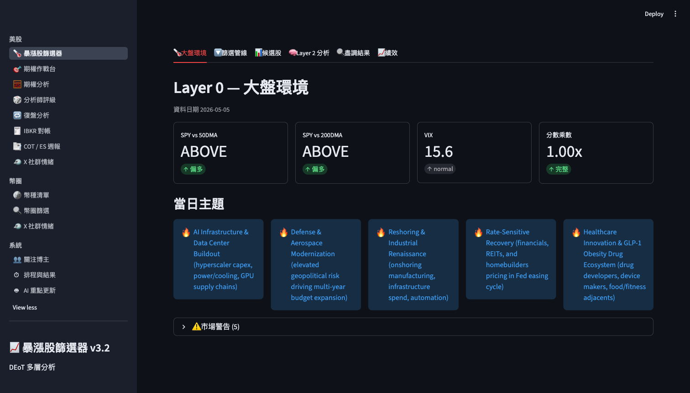

**功能用途**:實現 DEoT(Dynamic Expert-of-Thought)多層篩選器,把整個股票宇宙逐層收斂為高品質候選股,並提供完整的決策透明度與績效回溯。

**操作流程**

1. 點選左側「🌡 暴漲股篩選器」進入,自動載入最新篩選結果。
2. 側邊欄顯示 6 項管線檔案狀態(✅ 已有資料 / ⬜ 未生成):硬篩選、LLM 評分、引擎控制器、深度盡調、報告、績效帳本。
3. 從側邊欄「報告日期」下拉切換不同掃描日期。
4. 逐一點擊 6 個頁籤:
   - **[0] 🌡 大盤環境** — 市場制度(SPY vs MA、VIX、當日主題、市場警告)
   - **[1] 🔽 篩選管線** — 漏斗圖與各階段通過率
   - **[2] 📊 候選股** — 七維雷達圖、分數表、分析師評級、訊號與風險、進場區間
   - **[3] 🧠 Layer 2** — 引擎控制器的決策樹(BREADTH/DEPTH/TERMINATE)
   - **[4] 🔍 盡調結果** — SEC 10-Q/8-K 盡調(confirmed / downgraded / rejected)
   - **[5] 📈 績效** — 績效帳本、30 日報酬分布(Box Plot)、回測統計
5. 在各頁籤點擊「展開/摺疊」(expander)顯示細節。

**背後運作邏輯**

- **硬篩選** (`filtered_universe.json`):掃描全 US(或 NASDAQ_SP1500),套用 8 項硬指標(SPY vs 50/200DMA、VIX 級別、Minervini Trend Template、MACD、成交量、RSI 背離、反轉型態、$1B+ 市值),資料來自 yfinance 日線+週線。
- **Deterministic Rank** (`ranked_candidates.json`):程式先用 hard-filter 欄位計算 `rank_score 0-100`,權重為技術趨勢 25、動能強度 20、啟動訊號 20、流動性/可交易性 20、過熱風險控制 15。預設 top 50 作為今日候選池。
- **可選 LLM Deep Check** (`scored_candidates.json`):只對 ranked pool 中少量標的沿 7 維度評分 — 技術(0-30)、催化劑(0-16)、情緒(0-13)、籌碼(0-10)、板塊(0-3)、選擇權流(0-20)、分析師(0-8);綜合分數再乘以大盤乘數(VIX/Fed 降權)。**>65 進 Layer 2,≥50 納觀察名單,<50 自動 REJECT**。
- **Layer 2** (`layer2_results.json`):引擎控制器最多迭代 2 層、每層 6 節點,每層決策 BREADTH(橫向對標)/ DEPTH(縱向深掘)/ TERMINATE;輸出透明的分析樹,最終動作 CONTINUE_TO_DD / WATCHLIST / REJECT。
- **Layer 3 盡調** (`dd_results.json`):Dexter DD 技能分析最近 60 天 SEC 10-Q/8-K,輸出關鍵發現、警訊清單、做空論點強度、最終建議。
- **報告** (`reports/<date>/summary.json`):當日投組摘要(regime_summary、ranked_picks、watchlist、主題集中度警告、策略備註)。
- **績效帳本** (`reports/performance_ledger.csv`):每筆已發佈選股的 3/7/14/30/60 日前瞻報酬、+15%/30% 命中旗標、最大回撤。

**小技巧 / 注意事項**

- 若 `options_flow` / `X_velocity` 分數為 0,代表資料缺口,綜合分數應理解為「**下界估計**」。
- 側邊欄檔案狀態只反映「**檔案是否存在**」,不保證內容有效;若顯示 ✅ 但頁內顯示「尚無資料」,可能是空檔/損毀。
- **反例警告**(anti_example_warning)為歷史失敗案例聚類,出現紅框時應強制 SKIP,勿主觀覆蓋。
- 績效欄位顯示「待計算」屬正常:新選股需等每日 20:00 EST 回填前瞻報酬;掃描日期 > 今日則 30 日報酬必為空(無法回測未來)。
- 若 7 維都 >80% 但總分仍 <65,多為大盤乘數被大幅降權(VIX>30 或 Fed 升息),請檢視 regime_context 警告。

---

### 🎯 期權作戰台 (Options Cockpit)

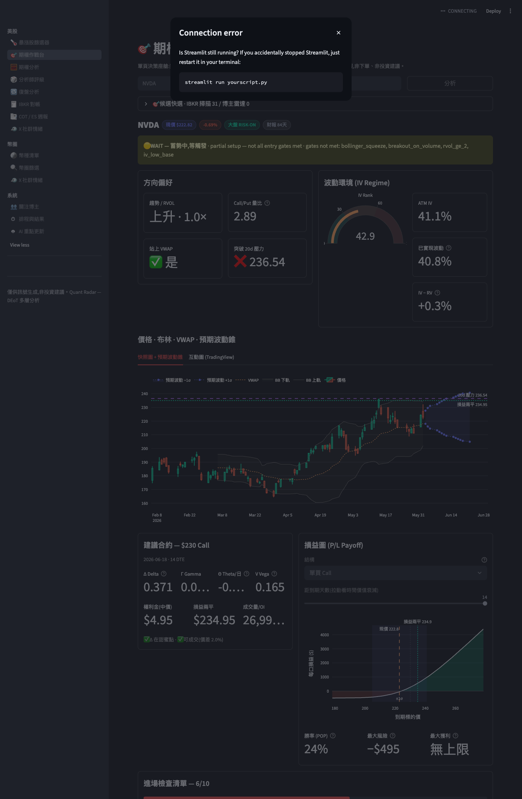

**功能用途**:在單一頁面快速評估一檔標的是否符合期權進場條件 — 判定(GO/WAIT/AVOID)→ 方向偏好 → IV 波動環境 → 價格圖表 → 建議合約與損益圖 → 進場檢查清單。唯讀決策支援,基於真實 Black-Scholes 定價。

**操作流程**

1. 在文字欄輸入美股代號(如 NVDA),按「分析」。
2. 檢視頂部 Verdict 警示(綠 GO / 黃 WAIT / 紅 AVOID)與 4 項背景原因。
3. 左欄「方向偏好」:趨勢+RVOL、Call/Put 量比、是否站上 VWAP、是否突破 20 日壓力。
4. 右欄「波動環境」:IV Rank、ATM IV、已實現波動、IV 溢價/折扣。
5. 若 DTE 內有財報 → 顯示紅色 IV crush 警示。
6. 查看「價格‧布林‧VWAP‧預期波動錐」靜態圖,或切換互動 TradingView 圖。
7. 左欄「建議合約」:Δ0.3–0.4 甜蜜點 call(履約價、到期、希臘值、權利金、損益兩平、流動性)。
8. 右欄「損益圖」:選「單買 Call」或「牛市買權價差」,拉時間軸看時間衰減,查 POP、最大風險、最大獲利。
9. 展開「進場檢查清單」(10 項條件 ✅/❌ + 進度條)、「期權鏈量分佈」、「IV 走勢」。

**背後運作邏輯**

- 價格與技術指標:yfinance ~15 分延遲日線,算 20/50/200 日線、布林(20,2)、VWAP(20d)、RVOL、ATR、RSI、20 日壓力。
- 期權鏈:取最接近 2–3 週 DTE(10–25 天)到期月份。
- 希臘值與權利金:自製 Black-Scholes(`options_analytics.py`,全 app 唯一數學源)。
- IV Rank/百分位:`iv_history.py` 每日 ATM IV 累積快照(需滿 **40 天**才算真實百分位,未滿前以已實現波動代理並標「累積中」)。
- 財報風險:yfinance calendar / earnings_dates 判斷是否在 DTE 內。
- 大盤風情:從 `scored_candidates.json` 的 regime_context 讀(SPY > 200DMA + VIX < 25 = risk-on)。
- **GO 三高牆**:IV 真實且 < 30%、財報已知且 > DTE、合約可成交(雙邊報價、價差 ≤12%)。任一失敗即被阻止為 WAIT。

**小技巧 / 注意事項**

- ~15 分延遲資料,適合**收盤後掃描次日機會**,不適 0DTE 盤中。
- 即時資料抓不到時自動切到 deterministic mock(以代號 MD5 為種子),畫面與計算仍為真實,可重試載入真實鏈。
- 高 IV 環境改用「牛市買權價差」可降低虧損上限;低 IV 環境「單買 Call」乘數更大但無下檔保護。
- POP 為**零漂移**假設下的保守機率估計,不含預期方向。
- 預期波動錐 ±1σ 假設 IV 恆定;財報後 IV crush 會使圖形失效(故強制財報警示)。

---

### 🧮 期權分析 (US Options)

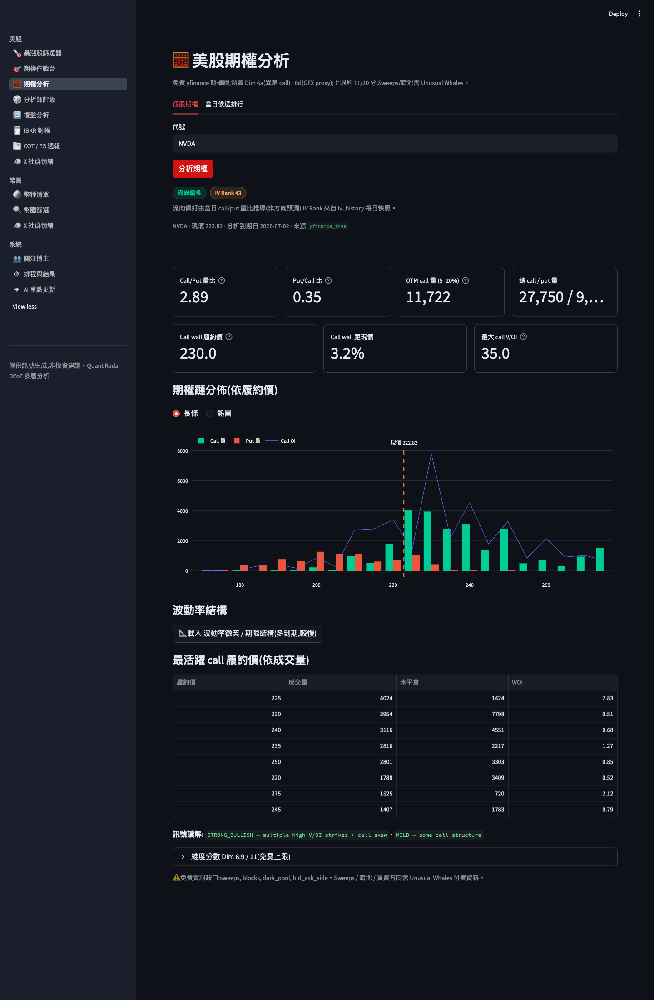

**功能用途**:免費美股期權鏈分析,涵蓋異常 call 活動(Dim 6a)與 GEX gamma 代理(Dim 6d),協助判斷期權流向偏好與波動率結構。

**操作流程**

1. 在「個股期權」頁籤輸入代號(NVDA / AMD),按「分析期權」。
2. 觀看頂部「流向偏好」與「IV Rank」晶片(綠/黃/紅)。
3. 檢視 Call/Put 量比、V/OI、價外 call 成交量等 4 項指標卡。
4. 切換「長條 / 熱圖」看履約價分佈的成交量/OI。
5. 點「📐 載入 波動率微笑 / 期限結構」(多到期,較慢,快取 15 分鐘)。
6. 觀察微笑(左側 put IV 翹起 = 下檔避險需求)與期限結構(近月 > 遠月 = backwardation)。
7. 看「最活躍 call 履約價」表格、展開「維度分數」、回「當日候選排行」依判定/IV-Rank 排序。

**背後運作邏輯**

- 取 yfinance 最接近 **30 DTE** 主鏈 + 最近週選。
- **Dim 6a(滿分 8)**:cp_ratio >1.2 偏多、Put/Call >1.8 直接 -3 分;V/OI ≥2.0 為異常活躍。
- **Dim 6d(滿分 3)**:現價±5% 內 put OI > call OI×1.5 = 負 gamma 代理;偵測 call wall。
- **免費缺口**:6b Sweeps/Blocks、6c 暗池需 Unusual Whales 付費資料,**永遠評 0**(免費上限約 11/20)。
- IV 反演:用 `options_analytics.py` 以二分法從 mid 價格反推 IV(避免 yfinance 原生 IV 欄垃圾)。
- 「當日候選排行」讀 `data/scored_candidates.json`,IV-Rank 來自 `iv_history.py`(需 ≥40 天快照)。

**小技巧 / 注意事項**

- 「流向偏好」由當日成交量推導,**非方向預測**,需搭配技術面與新聞。
- **OI 常於盤中回傳 0**(OCC 每日收盤後才更新),盤中以成交量為主;準確 OI 牆建議 3–4pm 後或隔日查看。
- 波動率微笑載入較慢(多到期 yfinance 呼叫),首次點擊後快取 15 分鐘,勿頻繁點擊。
- V/OI >2 只表異常活躍,未必預示方向(大戶可能雙邊掃單或避險)。

---

### 🎲 分析師評級 (Analyst Views)

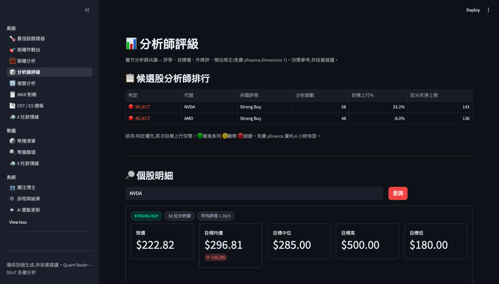

**功能用途**:展示賣方分析師共識評級、目標價、升降評與預估修正動態,作為決策參考。分為候選股排行榜(多代碼)與個股明細(單代碼)。

**操作流程**

1. 進「美股 → 分析師評級 🎲」。
2. 上方「📋 候選股分析師排行」自動展示管線評過的候選股(共識、家數、目標上行%、近 30 天淨上修)。
3. 點表格列或在「代號」欄輸入任意美股代碼(不限候選股)。
4. 下方「🔎 個股明細」自動更新:共識評等、平均評分(1~5)、目標價範圍、評等分布圖、近期升降評、預估修正。

**背後運作邏輯**

- 全部資料來自 yfinance 免費 API(Yahoo 聚合),**非 LLM 生成**,遵循「驗證資料進 AI」原則。
- 來源 `scripts/analyst_free.py → gather_analyst_views()`,快取 TTL **6 小時**,任何抓取失敗回 None **永不拋例外**。
- 淨修正值 = Σ(上修) − Σ(下修),正值 = 上調動能(Dimension 7c 領先子訊號)。
- 排行排序:判定優先(綠 STRONG_BUY/BUY/NEEDS_LAYER_2 → 黃 → 紅)→ 再按目標上行%。

**小技巧 / 注意事項**

- 排行表為空時,先確認管線已執行(GitHub Actions `workflow_dispatch` 選 `screener`,或本機依序 `python scripts/01_hard_filter.py` → `python scripts/02_llm_score.py`)。
- 輸入代碼自動 `.upper().strip()`,無需手動大寫。
- 近期升降評表最多 8 筆;某區塊無資料會自動隱藏。
- 「無分析師資料」可能因新股覆蓋率低、公司規模小,或 Yahoo 源暫時故障。

---

### 🔁 復盤分析 (Retro Analysis)

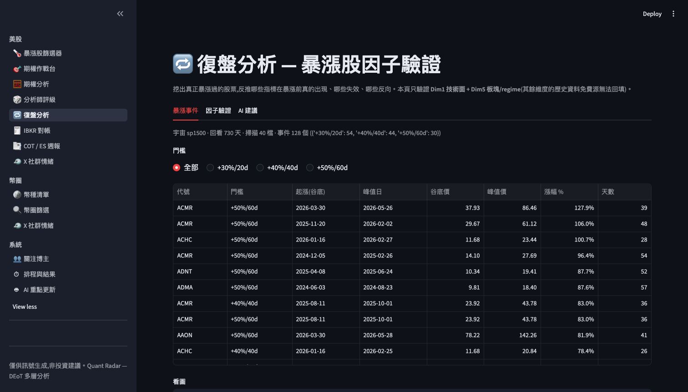

**功能用途**:由歷史回測挖出真正暴漲過的美股,逆向重構其暴漲前的技術/板塊面貌,以 LIFT 倍數驗證系統評分指標中哪些有效、失效、反向,供交易員手動調整策略權重(**讀寫分離**:本頁純展示)。

**操作流程**

1. 先依序執行復盤管道(嚴格順序):
   ```
   python scripts/retro_surge_label.py --universe sp1500 --lookback-days 730
   python scripts/retro_reconstruct.py
   python scripts/retro_factor_lift.py
   python scripts/retro_report.py --provider auto
   ```
2. **「暴漲事件」**標籤:看掃描摘要、選門檻(+30%/20d、+40%/40d、+50%/60d)、依漲幅排序的事件表、嵌入 TradingView 看圖。
3. **「因子驗證」**標籤:看水平條狀圖(每條 = 一子因子的 LIFT 倍數,虛線標 1.0),依判定染色(綠驗證/藍微弱/灰雜訊/橙反向);展開「Phase 2 · 六維前向驗證」。
4. **「AI建議」**標籤:看 AI 總結與三欄分類(✅ 已驗證 / ➖ 雜訊 / 🔄 反向)、覆蓋缺口、建議變更。

**背後運作邏輯**

- **暴漲事件**:`retro_surge_label.py` 用調整收盤價偵測過去 2 年非重疊暴漲事件;T0 定義為暴漲啟動的谷底(峰值區間內最低點),以對齊篩選器進場時刻。
- **特徵重構**:`retro_reconstruct.py` 在「確認日」(T0 後首個 +7% 日)重建 Dim1 技術 + Dim5 板塊特徵,用**未調整**收盤價以匹配即時引擎。
- **LIFT 計算**:`retro_factor_lift.py` 對照隨機抽樣(排除暴漲視窗 ±90 日),**LIFT = P(因子|暴漲) / P(因子|隨機)**。判定門檻:VALIDATED(≥1.5 且支持≥20)/ WEAK(1.1–1.5)/ NOISE(0.9–1.1)/ CONTRARIAN(<0.9)/ INSUFFICIENT(支持<5)。90% CI 由 1000 次 bootstrap。
- **AI 報告**:`retro_report.py` 把 LIFT 表餵 Claude,產出分類與建議 JSON,**完全讀寫分離**,交易員手動編輯 `system_prompts/01_surge_screener_prompt.md`。

**小技巧 / 注意事項**

- 暴漲事件 < 30 時出現「樣本偏小」警告,結論僅供方向參考;建議回看 ≥ 2 年累積 30–50 事件。
- **LIFT ≠ P(surge|factor)**;表中「精準 LIFT」(precision_lift)更接近投資決策的相關數字。
- **存活偏差不可消除**:已下市暴漲股遭遺漏 → 實際預測力被保守低估,解讀時打折。
- Dim2/Dim4 需另跑 `retro_edgar_backfill.py`;Dim3/Dim6 無免費歷史,需 Phase 2 前向累積。
- 所有建議**不自動套用**,需人工 commit。

---

### 🧾 IBKR 對帳 (IBKR Reconcile)

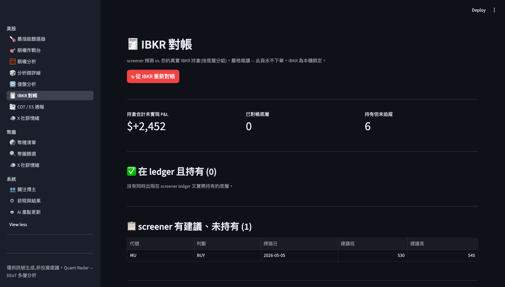

**功能用途**:對帳 Screener Ledger 預測與你 IBKR 帳戶真實持倉,以三視角呈現:已對帳、Ledger 未持有、持有但未追蹤。**嚴格唯讀,永不下單**。

**操作流程**

1. 點「🧾 IBKR 對帳」進入。首次會提示「尚無對帳資料」。
2. 本機開 IBKR Gateway 或 TWS(啟用 API),執行 `python scripts/ibkr_client.py reconcile`,或按頁面藍色「↻ 從 IBKR 重新對帳」(無訂單風險,約 10–15 秒)。
3. 頂部三 Metric:合計未實現 P&L、已對帳檔數、持有但未追蹤檔數。
4. 向下查看三區塊:「✅ 在 ledger 且持有」、「📋 screener 有建議、未持有」、「🔎 你持有、screener 未追蹤」。

**背後運作邏輯**

- 資料源:`reports/performance_ledger.csv`(日更)+ 即時 `ib_async` 連線 IBKR(`readonly=True`)讀取 `portfolio()` 與 `reqPnL`;結果寫 `reports/reconciliation.json`(Gitignore,本機限定)。
- 三向分類:matched / ledger_not_held / held_not_in_ledger。
- 選權成本由 per-contract(premium×100)除以 multiplier 轉為 **per-share**,使成本與現價可比;`return_pct = unrealizedPnL / cost_basis × 100`。
- 連線埠位嘗試序:7497(TWS paper)→ 4002(Gateway paper)→ 7496(TWS live)→ 4001(Gateway live),可用 `IBKR_PORT` 覆蓋。

**小技巧 / 注意事項**

- 前提:本機 `pip install -r requirements-ibkr.txt` + Gateway/TWS 啟用 API(Configure > API > Settings)。
- 雲端/CI 未裝 `ib_async`,故此功能**本機限定**,「重新對帳」按鈕在雲端自動停用。
- 「已對帳」的建議區與 30d 預期為**掃描時的靜態數據**,不即時更新。
- 「持有未追蹤」通常代表手動下單或 Screener 已放棄追蹤的舊部位,值得重新評估。
- P&L 著色:>0 綠、<0 紅、=0 灰;缺值顯示「—」。

---

### 📑 COT / ES 週報 (US COT)

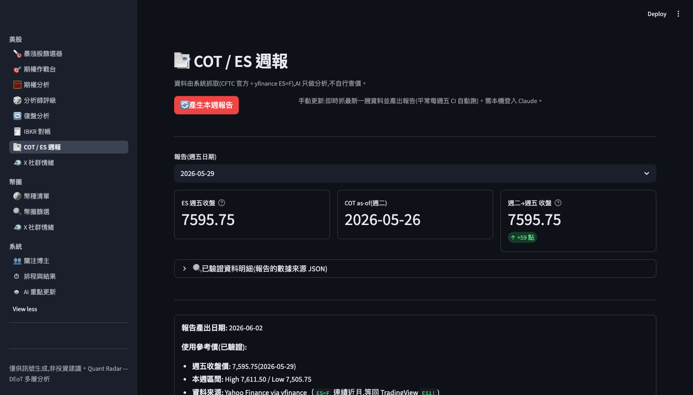

**功能用途**:每週展示 AI 撰寫的 E-mini S&P 500(ES)期貨 COT 籌碼週報,涵蓋籌碼結構、機構博弈、交易策略、風險提示四大板塊。

**操作流程**

1. 進「📑 COT / ES 週報」。
2. 點「🔄 產生本週報告」(平時由週五 CI 自動執行;手動需本機登入 Claude/Max)。約 30–60 秒。
3. 若見「⚠️ ES=F 價格無法驗證,未產生報告(反幻覺保護)」需待資料更新後重試。
4. 成功後在「報告(週五日期)」選框選日期。
5. 看三指標卡(ES 週五收盤、COT as-of 週二、週二→週五點數變化)。
6. 展開「🔍 已驗證資料明細」查 JSON;點四大標籤閱讀報告。

**背後運作邏輯**

- 資料蒐集(`scripts/cot_es.py`):CFTC 公開 API(gpe5-46if,TFF futures-only)抓 Asset Managers / Leveraged Funds 淨部位與週變化 + OI;yfinance 抓 ES=F COT-week 週五 OHLC。
- **反幻覺閘道**:若 yfinance 無法提供該週五確切收盤,**直接拋錯中止**,絕不退而用前一日或任意日期。
- 組裝 `verified.json`(cot + price + tuesday_vs_friday + 時間戳),交給 Claude 依 `system_prompts/07_cot_es_analyst_prompt.md` 撰寫;LLM 只能用 JSON 數值,不得自行搜尋。
- **原子性寫入**:先寫 `verified.json` 後寫 `.md`,`os.replace()` 確保不脫鉤、不留半寫狀態。

**小技巧 / 注意事項**

- 手動觸發需已用 Claude/Max 登入本機,否則報 `PriceUnverified` 或網路錯誤。
- 稽核面板的 `verified.json` 是報告**唯一事實來源**;對數字有疑問請展開 JSON,而非依賴 AI 文案。
- 顏色編碼:綠 = 期間上漲、紅 = 期間下跌(與市場方向同義,與投機盤持倉方向無關)。
- COT 數據截至週二,交付時通常已逾 5–7 天;>9 天會顯示「⚠️ COT 報告偏舊」。
- ES 每點 $50,日內常逾百點,單筆風險建議 ≤ 帳戶 1–2%。

---

### 🐦 X 社群情緒 — 美股/幣圈 (X Sentiment)

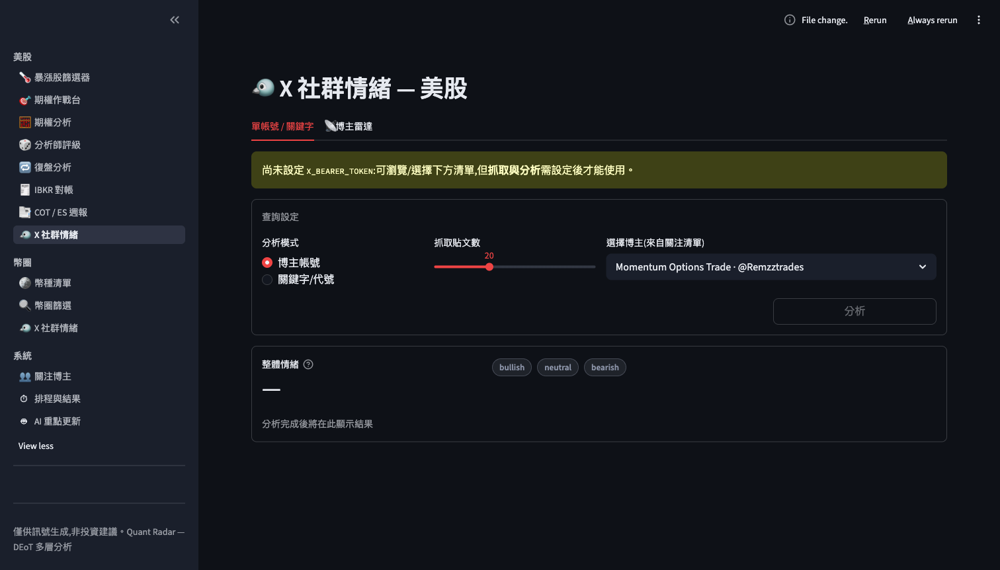

> 美股路徑 `/us-x`、幣圈路徑 `/crypto-x`,版面相同,僅切換博主清單與標的。

**功能用途**:以 free-first social intelligence 流程整合社群發現與免費熱度基線。X/Grok 或 Agent Reach 可提供 ticker discovery；StockTwits 驗證單 ticker retail sentiment；ApeWisdom 提供 Reddit/WSB crowd heat baseline。付費 X/Grok 自動化不是免費核心成功條件。

**操作流程**

1. 進「X 社群情緒」,選市場分組(美股/幣圈)。
2. **單帳號/關鍵字**:選分析模式(「博主帳號」從清單選或自訂輸入;「關鍵字/代號」輸入 $NVDA、BTC)。
3. 用「抓取貼文數」滑桿(5–50,預設 20),按「分析」。
4. 看「整體情緒」(🟢/🟡/🔴)、情緒分數(-1.0~1.0)、摘要、主題標籤、代表貼文;展開「原始貼文」。
5. **博主雷達**分頁:優先載入 `reports/social_intelligence/latest.json`;沒有新快照時回退 `reports/x_influencer_picks.json`。設「回看天數」(1–14)後點「↻ 重新分析博主」仍需 `XAI_API_KEY`。
6. 看 Ticker 候選表(提及人數、傾向、信心)、各博主重點、citations。

**背後運作邏輯**

- 單帳號爬取:X API v2(需 `X_BEARER_TOKEN`, paid optional);情緒分析用 `LLMClient`(claude-sonnet-4-6),輸出 JSON(overall_sentiment / sentiment_score / summary / key_themes / highlights / stance)。
- 博主雷達:xAI Grok(grok-4.3)的 **x_search** 工具,以 `allowed_x_handles` **僅搜該博主**(非全網爬蟲);`build_picks` 純計算聚合 symbol(去重、count、skew、conviction)。`scripts/social_intelligence.py` 會把 discovery rows 加上 StockTwits/ApeWisdom baseline、平台候選/期權驗證與 cost/status。
- **無害設計**:唯讀;所有 ticker/傾向皆附 citations 出處;Grok 指示明確「NEVER invent posts」。

**小技巧 / 注意事項**

- **金鑰**:X API 需 `X_BEARER_TOKEN`(paid optional);自動 Grok x_search 需 `XAI_API_KEY`(console.x.ai,與 X/Grok subscription 分開);情緒 LLM 需 `ANTHROPIC_API_KEY` 或已登入 Claude Code(否則降級顯示原始貼文)。
- **X/Grok subscription**:可用於人工研究與 UI 內「複製到 Grok」prompt,但不能直接當 pipeline API,也不能產生 `XAI_API_KEY` 或 `X_BEARER_TOKEN`。
- 社群情報快照可跑 `python scripts/social_intelligence.py --market US`;forward validation 可跑 `python scripts/social_intelligence_outcomes.py`。
- 博主雷達舊相容輸出仍是 `reports/x_influencer_picks.json`,之後可離線查看快取。
- 自訂博主加進快選:編輯 `content/influencers.json`。
- x_search 上限 20 handle,超過自動截斷並警告。

---

### 🪙 幣種清單 (Crypto Universe)

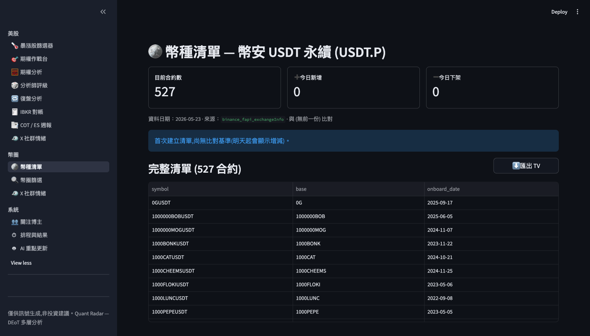

**功能用途**:顯示幣安 USDT 永續期貨(USDT.P)交易對完整名單,突顯與前一日增減,並提供 TradingView 匯入檔。

**操作流程**

1. 在「幣圈」分組點「🪙 幣種清單」。
2. 頂部三卡:目前合約數、➕ 今日新增、➖ 今日下架。
3. 中部兩欄表格看新增(🟢)/下架(🔴)。
4. 在「完整清單」點「⬇️ 匯出 TV」下載 `tradingview_watchlist.txt`。
5. 在 TradingView → Watchlist → Import list 一鍵匯入。

**背後運作邏輯**

- 讀 `reports/crypto/universe_latest.json`(由 `scripts/crypto_universe.py` 每日產生)。
- 資料源:幣安公開 `fapi/v1/exchangeInfo`(**無需 API Key**),篩 PERPETUAL + USDT + TRADING。
- 與前一日快照比對差集:`added = 今日 − 前日`、`removed = 前日 − 今日`。
- TradingView 格式:每行 `BINANCE:SYMBOL.P`。**100% 來自交易所端點,無 LLM,無幻覺**。

**小技巧 / 注意事項**

- 報告日期與實時可能有一日延遲;需最新可本機跑 `python scripts/crypto_universe.py`。
- 首次執行無對比基準(added/removed 為空),第二日起才顯示增減。
- UI 快取 TTL 60 秒,剛跑完腳本可按 F5 強制刷新。

---

### 🔍 幣圈篩選 (Crypto Screener)

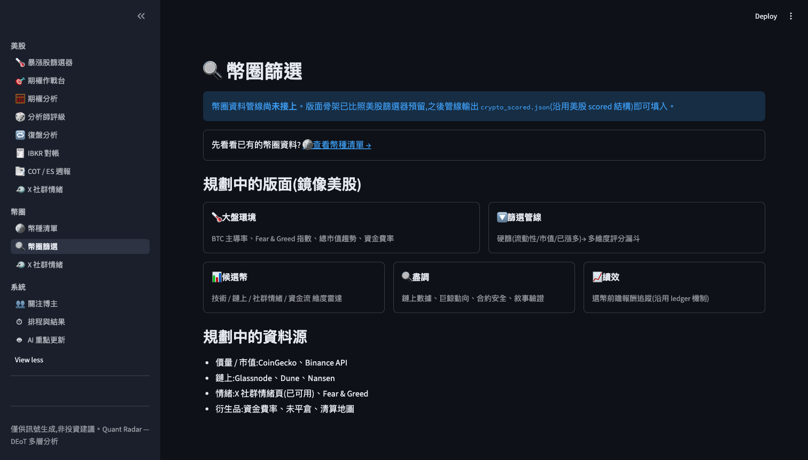

**功能用途**:幣圈信號篩選中樞,鏡像美股篩選器架構。**目前管線尚未接上**,頁面展示計畫中的完整功能骨架與資料源。

**操作流程**

1. 在「幣圈」分組點「🔍 幣圈篩選」。
2. 若 `crypto_scored.json` 已存在 → 自動渲染評分結果。
3. 若未接上(目前狀態)→ 顯示「幣圈資料管線尚未接上」,並提供連至「🪙 查看幣種清單」的導航卡。
4. 向下滾動看「規劃中的版面(鏡像美股)」5 大模組與「規劃中的資料源」。

**背後運作邏輯**

- 設計為「鏡像美股篩選器」,評分結構沿用 `scored_candidates.json` 格式。
- 讀 `crypto_scored.json`(repo 根目錄);若不存在,`load_json()` 回 None,頁面進「預覽模式」(不拋錯)。
- 規劃資料源:CoinGecko / Binance FAPI(已用)、Glassnode / Dune / Nansen(需 API key)、Fear & Greed、資金費率。

**小技巧 / 注意事項**

- 目前為「**骨架就位、資料待接**」,上線時間取決於上游評分管線進度。
- 一旦評分管線開始輸出 `crypto_scored.json`,頁面**自動偵測**並開始渲染,無需重新部署。
- 純唯讀,無篩選表單或參數調整。

---

### 👥 關注博主 (Influencers)

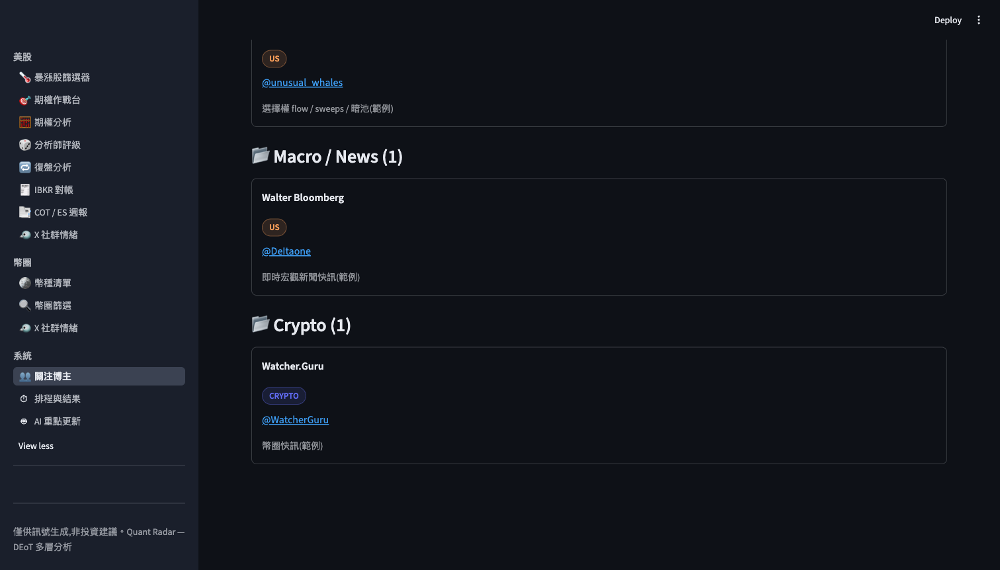

**功能用途**:依分類展示追蹤的 X 博主名單。此清單為**單一真實資源**,同時被「X 社群情緒」頁的快速選單引用。唯讀展示,新增/編輯需改 `content/influencers.json`。

**操作流程**

1. 側邊欄「系統」→「👥 關注博主」。
2. 預設展示所有市場;用上方「市場」單選按鈕(全部/US/CRYPTO)篩選。
3. 統計更新為「X 位博主 / Y 個分類」。
4. 以分類分組查看卡片,點藍色「@帳號」開啟其 X 個人頁。

**背後運作邏輯**

- 讀 `content/influencers.json`(人工維護),含 `influencers` 陣列(handle/name/category/market/note/url)與 `categories_order`。
- 分組依 `categories_order`,未列分類按字母序附加;同分類內按 handle 字母序。
- **模板機制**:`placeholder=true` 記錄在統計中排除、UI 顯示為「🧩 *模板*」,且**不出現**在 X 情緒頁快選(`for_market()` 過濾)。
- 市場標籤色:US = 琥珀(#FFA15A)、CRYPTO = 藍(#636EFA)。快取 TTL 60 秒。

**小技巧 / 注意事項**

- 編輯清單直接改 JSON(至少需 handle + market),改完 F5 即自動載入。
- 調整分類順序在 `categories_order` 重排即可。
- 修改 JSON 後 X 情緒頁的選單會**自動同步**。

---

### ⏱ 排程與結果 (Schedules)

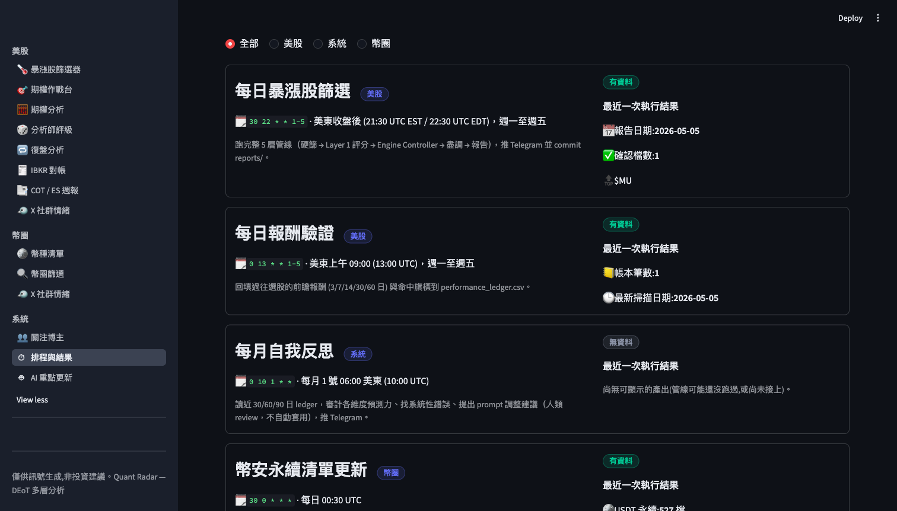

**功能用途**:讓你理解系統 5 組自動化排程(每日篩選 / 每日報酬驗證 / 每月自我反思 / 幣圈清單 / COT 週報),查看每組最後一次執行結果與時間表。

**操作流程**

1. 側邊欄「系統」→「⏱ 排程與結果」。
2. 頂部顯示 5 組排程卡片(執行時間、分類、最近結果)。
3. 用「分類」單選鈕篩選(全部/美股/系統/幣圈)。
4. 「無資料」灰色芯片代表未成功執行或尚未 commit。

**背後運作邏輯**

- 排程定義在 `content/schedules.json`(UI 端登錄表,非 GitHub Actions 即時狀態);每組對應 `result_type` 決定如何抓最新產出。

| 排程 | cron (UTC) | 結果來源 |
|---|---|---|
| 每日暴漲股篩選 | `30 22 * * 1-5` | `reports/YYYY-MM-DD/summary.json` |
| 每日報酬驗證 | `0 13 * * 1-5` | `reports/performance_ledger.csv` |
| 每月自我反思 | `0 10 1 * *` | `reports/reflections/YYYY-MM.md` |
| 幣安永續清單 | `30 0 * * *` | `reports/crypto/universe_latest.json` |
| COT / ES 週報 | `0 23 * * 5` | `reports/cot/YYYY-MM-DD.md` |

- **狀態芯片**:成功讀到產出 → 綠「有資料」;否則 → 灰「無資料」。

**小技巧 / 注意事項**

- cron 用 UTC;美東減 4–5 小時、台灣加 8–12 小時。
- **讀寫分離**:UI 純讀,所有 commit 由 GitHub Actions 背景任務執行,使用者無法從 UI 觸發。
- 反思報告只提建議、**永不自動修改 prompt**;帳本為追記檔不可逆。
- UI 不檢查 Actions 即時狀態(running/queued),只讀已 commit 成品;即時進度請看 Actions 日誌。

---

### 🤖 AI 重點更新 (AI Updates)

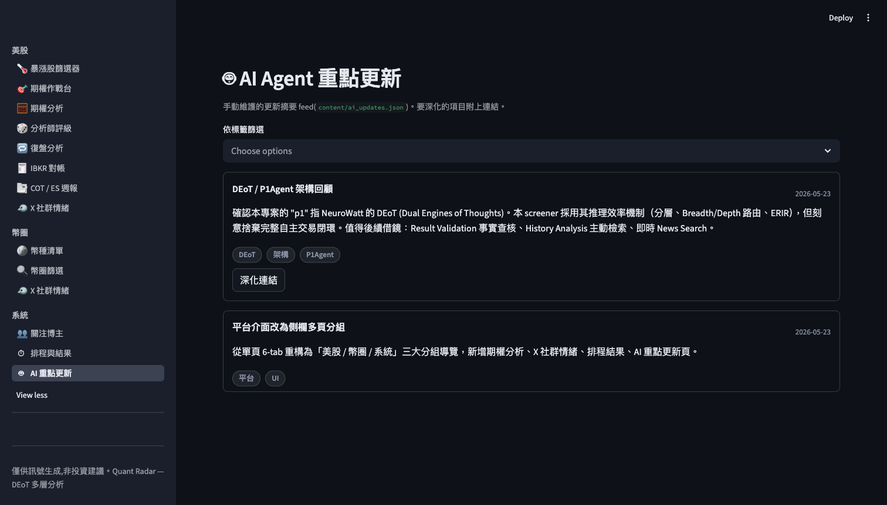

**功能用途**:集中展示手動維護的 AI 與市場重點更新摘要,每筆可附深化連結,支援標籤篩選。

**操作流程**

1. 側邊欄「系統」→「🤖 AI 重點更新」。
2. 卡片按日期倒序排列(最新優先)。
3. 若超過 3 個不同標籤,側邊自動顯示「依標籤篩選」多選下拉。
4. 閱讀標題、日期、摘要、標籤;點「深化連結」跳轉資源。

**背後運作邏輯**

- 讀 `content/ai_updates.json`(人工維護),每筆含 date / title / summary / link / tags。
- `_load_updates()` 依日期遞減排序;標籤篩選為**邏輯 OR**(tags 與所選集合有交集即顯示)。
- 快取 `st.cache_data(ttl=60)`。

**小技巧 / 注意事項**

- 100% 唯讀;新增/編輯改 `content/ai_updates.json`(必填 date/title/summary/tags)。
- 日期須 `YYYY-MM-DD`,UI 不驗證,格式錯會導致排序異常。
- tags 即使單一也需 `["標籤"]`;無標籤設 `[]`。link 留空則不渲染按鈕。
- 完全依賴靜態檔案,無外部 API,無幻覺風險。

---

## 4. 系統架構與資料流

> 📌 完整的功能地圖（24 頁 mindmap）、資料流全景、重疊矩陣與優化路線圖見 **[docs/system_panorama.md](system_panorama.md)**。美股期權波段交易者的使用順序、功能背後模組與收斂藍圖見 **[docs/options_trader_function_audit.md](options_trader_function_audit.md)**。

### 系統總覽

Quant Radar 前端是單一進入點的 Streamlit 多頁應用(`app.py`),後端是一組可獨立執行的 Python pipeline 腳本(`scripts/`)。**前端只負責「讀取並呈現」pipeline 預先算好的輸出**,不在頁面渲染時自行做繁重運算;真正抓資料、計算指標、呼叫 LLM 的工作都在 `scripts/` 完成。

整體分三層:

1. **Pipeline 層(`scripts/`)** — 由程式碼抓取已驗證的免費資料(yfinance、CFTC 官方 API、Binance 公開 exchangeInfo、SEC EDGAR),計算技術指標 / Black-Scholes 希臘值 / COT 部位,必要時把已驗證資料交給 LLM「只做分析」,輸出 JSON / CSV / Markdown。
2. **共用基建層** — 跨腳本與 UI 的單一真相來源。
3. **展示層(`app.py` + `ui/`)** — `st.navigation` 把頁面分成「今日決策 / 市場背景 / 研究驗證 / 資料維護 / 幣圈」五個工作流群組,每頁是 `ui/` 套件的一個 `render()` 函式。

### 資料流(單向)

資料永遠是「**程式碼先驗證 → 落地成檔案 → UI 讀檔呈現**」,LLM 只在中間做分析,從不負責取數。

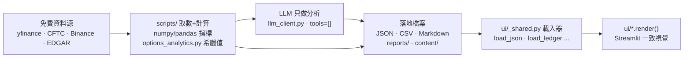

落地位置:每日報告 `reports/<日期>/`、COT 週報 `reports/cot/<friday>.md`(+ 原子寫入的 `.verified.json` sidecar)、IV 歷史 `reports/iv_history/<ticker>.json`、幣圈 `reports/crypto/`、對帳 `reports/reconciliation.json`(gitignored)、績效 `reports/performance_ledger.csv`。

### 反幻覺核心原則(verified-data-to-AI)

- **驗證資料餵 AI**:`cot_es.py` 在 prompt 明示「以下是已驗證資料(請勿自行搜尋或臆測)」;`momentum_options.py` 自己用 numpy 算指標、用 Black-Scholes 算希臘值,而不是問 LLM 猜數字。
- **LLM 不得自行取數(技術強制)**:`llm_client.py` 的 claude_agent 後端以 `tools=[]` 註冊空工具集,讓模型結構上看不到也叫不到 Bash/WebSearch/Read,每次呼叫退化成純文字補全。
- **唯讀、永不下單**:對 IBKR `readonly=True`;`cot_es.py` 價格無法驗證時直接拋 `PriceUnverified` 停產報告,連 LLM 都不呼叫。
- **資料缺口不得製造信心**:`momentum_options.py` 的 data_blockers 在 IV 只是代理、財報未知、或無可成交報價時,判讀最多到 WAIT,絕不給 GO。
- **單一數學真相源**:`options_analytics.py` 是全 app 唯一的 Black-Scholes/希臘值/POP/損益/IV 反解來源,momentum 引擎與作戰台 UI 都 import 它,確保損益圖與判讀一致。
- **色彩即語義**:GREEN/RED/AMBER = 多/空/中性;刻意把 ACCENT(警報紅)與 LOSS(損益負值紅)分開;熱力圖用色盲安全單色階(暗→青)。
- **永不 raise 的韌性**:載入器在讀寫失敗時回安全預設(None / available:False),單一缺檔不中斷整頁。

### 共用基建

| 模組 | 角色 |
|---|---|
| `scripts/options_analytics.py` | 全 app 唯一選擇權數學源(純 stdlib + numpy,無 scipy)。bs_call_greeks、prob_of_profit、expected_move、二分法 implied_vol。R_FREE=0.045。 |
| `scripts/llm_client.py` | 統一 `LLMClient.chat(system, user)`,多後端可換。`provider="auto"`:有 `ANTHROPIC_API_KEY`(CI)走付費 API,否則走本機登入的 Claude 訂閱;tools=[] 鎖死、char_cap + timeout 防失控、指數退避重試。 |
| `scripts/iv_history.py` | 每日 ATM-IV 快照存量。MIN_DAYS=40 前 accumulating=True;WINDOW_DAYS=252 提供 IV Rank/Percentile;原子寫入。 |
| `scripts/momentum_options.py` | verified-data 動能期權引擎,輸出 GO/WAIT/AVOID,快取 15 分鐘、永不 raise。 |
| `ui/_shared.py` | 跨頁設計 tokens、verdict_color、色盲安全 HEAT_SEQ、chip/metric_card/tradingview_chart,以及 load_json(60s)/load_ledger/load_reconciliation/load_analyst_views(6h)/find_report_dates 載入器。 |

### CI 排程與手動派發(`.github/workflows/surge_screener.yml`)

GitHub Actions cron(UTC):

| cron | Job |
|---|---|
| `30 22 * * 1-5` | 美股收盤後完整五層暴漲篩選(surge_scan) |
| `0 13 * * 1-5` | 每日美東 9:00 回填前向報酬(verify_returns) |
| `0 10 1 * *` | 每月 1 號自我反思(monthly_reflection) |
| `0 10 15 * *` | 每月 15 號暴漲復盤 / 因子驗證(monthly_retrospective) |
| `30 0 * * *` | 每日刷新 Binance USDT-perp 幣圈宇宙(crypto_universe) |
| `0 23 * * 5` | 週五 23:00 UTC(台灣週六 07:00)COT/ES 週報(cot_es) |

CI 中各 job 設 `ANTHROPIC_API_KEY`,`provider="auto"` 自動走付費 anthropic API;本機則走訂閱,無需改腳本。**手動派發(workflow_dispatch)**提供 `manual_job` 選單,可在 GitHub UI 單獨觸發 `screener` / `cot` / `crypto` / `retrospective`。

---

## 5. 常見問題 FAQ

**Q1. 資料有多即時?**
免費資料源(yfinance 等)延遲約 **15 分鐘**,因此系統定位為「**EOD 波段定位,非即時 0DTE 盤中觸發**」。分析師評級快取 6 小時、COT 通常落後 7 天、IBKR 對帳用延遲型行情(type 3)。適合收盤後掃描次日機會。

**Q2. 為何期權鏈的未平倉量(OI)常顯示 0?**
OI 由 **OCC 每日收盤後才更新**,盤中常回傳 0。此時頁面改以**成交量**作為強度指標,並提示「未平倉量暫無」。要看準確 OI 牆,請在美股 3–4pm 後或隔日收盤後查看。

**Q3. IV Rank 顯示「累積中」是什麼意思?**
yfinance 只給「當前 IV、無 52 週歷史」,所以 `iv_history.py` 每日累積 ATM-IV 快照。在滿 **40 天**(MIN_DAYS)之前無法計算真實百分位,標記 `accumulating=true`,改用**已實現波動百分位代理**;此狀態下期權作戰台的 GO 判定會被阻止。目前只有種子票(NVDA/AMD/TSLA/ARM/MU)有真值。

**Q4. 哪些功能需要本機登入 Claude?**
凡是**呼叫 LLM 但本機沒有 `ANTHROPIC_API_KEY`** 的功能:`make cot`(COT 週報手動產生)、復盤的 `retro_report.py`、暴漲篩選的 Layer1/2/3 等。`provider="auto"` 會走你登入的 Claude 訂閱(Max/Pro,免 API key)。X 情緒的 Grok 雷達另需 `XAI_API_KEY`,X 貼文爬取需 `X_BEARER_TOKEN`。

**Q5. 報告怎麼手動產生?**
- COT 週報:本機 `make cot`,或頁面點「🔄 產生本週報告」,或 GitHub workflow_dispatch 選 `manual_job=cot`。
- 暴漲篩選:`workflow_dispatch` 選 `screener`,或本機依序 `python scripts/01_hard_filter.py` → `python scripts/02_llm_score.py`。
- 復盤:依序跑 `retro_surge_label → retro_reconstruct → retro_factor_lift → retro_report`。
- 幣圈清單:`python scripts/crypto_universe.py`。
- X 博主雷達:`python scripts/x_influencers.py --market US --save`。

**Q6. 系統會自動下單嗎?**
**絕對不會。** 系統對 IBKR 嚴格唯讀(`readonly=True`,API 拒絕任何下單/改單/撤單),所有買賣由你手動執行。側邊欄固定標註「僅供訊號生成,非投資建議」。

**Q7. 某頁顯示「尚無資料」是出錯了嗎?**
通常不是。多數頁面只是「讀檔呈現」,對應 pipeline 尚未跑過時就顯示「尚無資料」並提示該執行的腳本。Layer2/3、復盤、COT、幣圈評分都是**按需/排程**產生。載入器設計為**永不 raise**,缺檔回安全預設值而非崩潰。

**Q8. 報告裡的「反例警告」紅框該怎麼處理?**
那是系統自動匹配歷史失敗案例聚類的結果。出現時應**強制 SKIP**,勿主觀判斷覆蓋 — 用以避免重複同類失誤。

---

## 6. 名詞表

| 名詞 | 說明 |
|---|---|
| **DEoT** | Dynamic Expert-of-Thought,本系統的多層分析架構:大盤環境 → 硬篩選 → Layer1 評分 → Layer2 控制器 → Layer3 盡調 → 報告/績效。 |
| **IV Rank / Percentile** | 當前隱含波動率在過去 52 週(252 日)區間中的位置(0–100)。需 ≥40 天快照才算真實值;綠(<30%)= premium 便宜、紅(>60%)= 昂貴。 |
| **Δ 甜蜜點(Delta sweet spot)** | Δ 0.3–0.4 的 OTM call,被視為高槓桿+高勝率組合(優於 0.5 ATM 的溫吞)。 |
| **POP(Probability of Profit)** | 到期時標的價 > 損益兩平點的機率,用零漂移對數常態分佈計算(保守估計,不含預期方向)。 |
| **預期波動(Expected Move)** | `em = spot × IV × √(DTE/365)`,±1σ 的預計波動範圍(假設 IV 恆定)。 |
| **Call wall** | 現價上方最大未平倉量(OI)的履約價,常作為短期阻力參考。 |
| **GEX(Gamma 代理)** | 以現價附近 call/put OI 比推估的 gamma 環境;put OI > call OI×1.5 = 負 gamma 代理(交易商可能賣方)。非真實 GEX。 |
| **Bollinger 擠壓** | 布林帶寬 ≤ 過去 126 日的 25 百分位,代表蓄勢(壓縮)訊號。 |
| **RVOL(相對成交量)** | 當日量相對近期均量的倍數,≥2× 為帶量異動。 |
| **VWAP** | 成交量加權平均價(20 日);現價站上 VWAP 為趨勢確認。 |
| **IV crush** | 財報等事件後 IV 驟降,使買方期權快速貶值;故 DTE 內有財報時強制警示、阻止 GO。 |
| **LIFT** | 復盤因子驗證指標,`LIFT = P(因子|暴漲) / P(因子|隨機)`。>1.5 且支持≥20 = VALIDATED,<0.9 = CONTRARIAN(反向)。 |
| **精準 LIFT(precision_lift)** | `P(surge|因子出現)` 與基率的比,比 LIFT 更接近投資決策的相關數字。 |
| **COT / TFF** | Commitment of Traders / Traders in Financial Futures;CFTC 公開的期貨持倉報告,本系統取 Asset Managers + Leveraged Funds 淨部位。 |
| **存活偏差** | 復盤用當前指數成員清單,已下市暴漲股遭遺漏,故檢測到的暴漲數 < 真實暴漲數,預測力被保守低估。 |
| **verified-data-to-AI** | 反幻覺核心原則:由確定性程式碼抓取並驗證真實資料,LLM 只做分析、不做抓取與臆測。 |
| **provider="auto"** | LLM 後端自動選擇:有 `ANTHROPIC_API_KEY`(CI)走付費 API,否則走本機登入的 Claude 訂閱(Max/Pro)。 |
| **placeholder(模板)** | 博主清單中的範例記錄,統計中排除、不進 X 情緒分析快選,僅供新增時參考。 |

---

## 7. 免責聲明

> **Quant Radar 僅供訊號生成,非投資建議。**
>
> 本系統所有頁面為**唯讀**展示,對券商(IBKR)**永不下單** — 任何買賣決策與執行均由使用者自行負責並手動進行。所有數據來自免費延遲資料源(約 15 分鐘延遲),定位為收盤後 / 波段研究參考,**不適合**即時或 0DTE 盤中交易決策。AI 生成內容嚴格基於系統驗證過的資料,但仍可能因上游資料源故障、覆蓋不足或時效落差而不完整。報告中的「積極/保守」策略、進場區間、評分與建議皆為架構分析與決策參考,**非交易推薦**。投資涉及風險,過往績效(含復盤回測)不代表未來表現,請依個人風險承受度、資金管理與停損紀律自行審慎評估。
