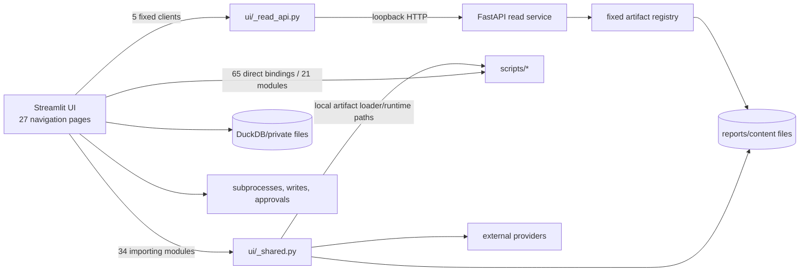

# Phase 4A Frontend/Backend Separation Gap Audit

- **Status:** Complete (static audit)
- **Date:** 2026-08-01
- **Branch:** `feat/frontend-backend-separation-phase3a`
- **Scope:** All 27 Streamlit navigation pages, the global AI chat shell, shared UI
modules, the loopback read API, and the direct UI-to-backend dependency boundary.

**Successor note:** The recommended Phase 4B and Phase 4C work has since been
implemented and verified; see
`docs/api/frontend-backend-separation-phase4b-4c-implementation.md`. Measurements
below intentionally remain the Phase 4A pre-change baseline.

## Executive verdict

Phase 3A-3E completed five **data-source API-only slices**, but the application is
not yet fully frontend/backend separated at the process or dependency level.

The five completed slices are the AI Updates feed, Schedules registry, Fund
Catalog, active single-ticker IV Rank, and standalone Options Flow persisted feed.
Their page resolvers call the five fixed loopback clients in `ui/_read_api.py`
and do not locally re-read those specific source artifacts after API failure
(`ui/_read_api.py:30-41,523-587`).

Three remaining gap classes prevent a global completion claim:

1. **Transitive shared-module coupling.** Thirty-four UI modules import
   `ui._shared`; `_shared` imports `scripts.artifact_loader` and
   `scripts.runtime_paths` at module load (`ui/_shared.py:51-61`). Therefore even
   a page whose selected data source is API-only can still load backend
   implementation modules through a level-2 dependency.
2. **Direct local/backend access.** The shrinking boundary inventory still has
   65 direct `ui -> scripts` import bindings across 21 UI modules
   (`scripts/test_ui_backend_boundary.py:14-82`). Twenty-four UI modules also
   call `_shared.load_json`, whose implementation reads an arbitrary caller
   supplied local path through the artifact loader (`ui/_shared.py:216-229`).
3. **Operational and private work remains inside Streamlit.** UI modules still
   perform file writes, subprocess launches, direct DuckDB access, provider
   calls, approvals, and local session storage. Examples include candidate-run
   status/history writes (`ui/_candidate_controls.py:296-320`), Analytics DB
   subprocess execution (`ui/analytics_db.py:639-640`), reconciliation writes
   (`ui/ibkr_reconcile.py:176-185`), roster edits (`ui/influencers.py:131-144`),
   and watchlist/reconciliation writes (`ui/watchlist_categorize.py:58-66,94-121`).

**Overall decision:** Phase 4 may continue, but only as small, source-bounded
slices. A one-shot `_shared` rewrite is **NO-GO**; it exceeds the 20-dependent
modularity threshold and intersects frozen UX source inventories. The next safe
move is to formalize the existing presentation-only `_components`/`_design`
island and migrate AI Updates off `_shared`, followed by a complete Crypto
Universe API-only page slice.

Confidence is **High** for import, route, and filesystem findings because they
come from exact source and inventory contracts. Confidence is **Medium** for
runtime behavior of lazy providers and actions because this phase did not launch
Streamlit or invoke external services.

## Scope and method

Included:

- Navigation entry points in `app.py:84-157`.
- All 42 Python modules under `ui/`.
- The 12 FastAPI GET operations, including health, in
  `api/main.py:464-632`.
- Fixed UI clients and failure contracts in `ui/_read_api.py:30-72,245-281`.
- Direct `scripts` imports, local reads/writes, DB access, subprocesses, live
  providers, and mutation actions reachable from UI modules.
- Level 0-2 dependency and shared-resource impact for the recommended next
  slices.

Excluded:

- Runtime provider availability, external rate limits, and visual browser
  behavior.
- Deployment, commit, push, and server mutation.
- The paused UX-1B formal lifecycle; this audit treats its current source
  inventories as constraints and does not rewrite them.

The audit used source enumeration, `rg` reference searches, current boundary
contracts, and Git churn history. No product code or runtime data was modified.

## Current architecture



The API and Streamlit processes are separately started, share a loopback network
namespace, and wait on API health (`docker-compose.yml:27-53`). The API enforces
loopback peer and Host checks (`api/main.py:389-423`) and exposes only GET routes;
it has no mutation or authenticated private-data contract. That is appropriate
for the current public read API but insufficient for moving IBKR, AI chat, raw
analytics, or operational controls.

## Measured boundary inventory

| Measurement | Current value | Evidence |
| --- | ---: | --- |
| Streamlit navigation pages | 27 | `app.py:84-147` |
| Python modules under `ui/` | 42 | `rg --files ui -g '*.py'` |
| FastAPI GET operations including health | 12 | `api/main.py:464-632` |
| Fixed Streamlit HTTP clients | 5 | `ui/_read_api.py:30-41,523-587` |
| UI modules consuming those clients | 5 | `ui/sys_ai_updates.py:41-51`; `ui/sys_schedules.py:45-51`; `ui/institution_portfolio.py:64-70`; `ui/us_options.py:49-67`; `ui/options_flow.py:40-58` |
| Direct `ui -> scripts` bindings | 65 across 21 modules | `scripts/test_ui_backend_boundary.py:14-82` |
| UI modules importing `_shared` | 34 | import search; `_shared` responsibility at `ui/_shared.py:1-5` |
| UI modules calling `_shared.load_json` | 24 | reference search; loader at `ui/_shared.py:216-229` |
| Implemented artifact routes without a Streamlit HTTP client | 6 | `api/main.py:476-563`; client list at `ui/_read_api.py:30-41` |

The six implemented but unadopted routes are ranked candidates, scored
candidates, Options Flow compatibility latest, Reversal Radar latest, Oversold
Reversal latest, and Market Thesis latest. Their compatibility DTOs validate
anchor fields while permitting extra source fields (`api/models.py:97-112,
314-325`); they should not become new API-only UI dependencies without a client
contract and, where needed, a strict public projection.

## Complete navigation-page disposition

Legend:

- **API slice complete:** the named persisted source is API-only; the whole page
  may still contain an independent provider or local source.
- **Public read candidate:** bounded persisted data suitable for a strict GET
  endpoint.
- **Operational/private:** requires a separately reviewed action, identity, or
  authorization design.
- **Deferred:** writer/schema or product behavior is not stable enough.

| Page | Current boundary | Phase 4 disposition | Evidence |
| --- | --- | --- | --- |
| 今日決策 | Local forecasts, candidate artifacts, signals, reconciliation, ledger, direct trade/quote engine, and candidate controls | Split public read aggregates from private position data and mutation controls; high-risk late slice | `ui/today_decision.py:17-19,54,94-162,592-604,630` |
| 交易狀態 | Direct local aggregate engine with ranked/social/options/risk inputs | Define a public projection; exclude position-bearing Risk Guard data | `ui/trade_state.py:12-13`; `docs/api/fastapi-endpoint-artifact-inventory.md:65` |
| 暴漲股篩選器 | Local filtered/scored/layer-2/DD/report/ledger reads | Candidate reads are public candidates, but migrate one source at a time after strict DTO review | `ui/us_screener.py:31-67` |
| 選擇權異常流 | Persisted feed API-only; live chain remains a direct provider | API slice complete; provider migration is a separate service operation | `ui/options_flow.py:40-76,213-247` |
| 個股總覽 | Local sector/retrospective context plus live fundamentals/options children | Split persisted context from user-directed live providers | `ui/stock_checkup.py:32,84-93,341,402` |
| 期權作戰台 | Eight direct script bindings, local private/public artifacts, live option data, and trade-state logic | Highest coupling; defer until candidate, market context, provider, and private action contracts exist | `ui/options_cockpit.py:38,46-48,203,255-257,629,771,798,1620-1662` |
| 雷達 | Local reversal/oversold snapshots, live reversal computation, and position-sensitive Risk Guard | Existing public signal routes can migrate separately; Risk Guard remains private | `ui/radar.py:16-18,36-57`; `ui/oversold_reversal_lane.py:21-43` |
| IBKR 對帳 | Private reconciliation reads/writes and IBKR session/provider | Operational/private; no read endpoint before identity and authorization | `ui/ibkr_reconcile.py:31-59,155,176-185,248-267` |
| 熱錢板塊輪動 | Local sector snapshots, scored candidates, refresh/provider, theme baskets | Persisted snapshot is a public read candidate; refresh/provider stays backend action | `ui/sector_rotation.py:191-198,250-258,330-369` |
| 主題資金流 | Local analysis/snapshot plus provider, cache freshness, and refresh controls | Split read DTO from refresh action and provider cache policy | `ui/theme_flow.py:49,69-76,157,365-399,520-554` |
| COT / ES 週報 | Local dated Markdown/verified JSON plus Codex-authenticated generation | Add server-enumerated list/detail GET before any generation action | `ui/us_cot.py:57,100,135,194-204,251-254` |
| 大盤行情研判 | Local latest forecast, validation, and regime history; latest GET already exists | Public read candidate after strict client/projection review | `ui/market_thesis.py:32-72,221-261`; `api/main.py:553-563` |
| X 社群情緒（美股） | Local social snapshots/fallback plus network, Codex, and roster-wide actions | Split snapshot read from refresh/research/auth actions; high churn | `ui/x_sentiment.py:74,196-197,287-288,755-798,863-932` |
| 復盤分析 | Local fixed retrospective bundles and CSV fingerprint | Public enum-based bundle candidate; no arbitrary path input | `ui/retro_analysis.py:47-73,612-623` |
| 資料健康 / Analytics DB | Direct DuckDB helpers, status files, writes, exports, and subprocess refresh | Public health summary only; raw DB/query/actions remain operational/private | `ui/analytics_db.py:19,78-200,466,639-736,948-1034` |
| 知識網路 | Direct `scripts.knowledge_graph` compilation of local Markdown | Public compiled snapshot candidate after content/read-error contract | `ui/knowledge_graph.py:18-20,96-143,569-576` |
| 期權分析 | Active IV Rank is API-only; candidate grid/history and full chain remain local/provider | API slice complete for IV Rank; avoid per-row HTTP N+1 | `ui/us_options.py:49-98,146,249,386-390` |
| 分析師評級 | Local scored candidates plus per-ticker live analyst provider | Candidate context may migrate; live provider remains separate | `ui/analyst_views.py:96-135,222-225,325-351` |
| 機構面板 | Fund Catalog API-only; SEC/yfinance providers and scored context remain direct/local | API slice complete for catalog; provider calls remain separate | `ui/institution_portfolio.py:51-70`; `ui/institutional_holdings.py:29-30,73-87` |
| 產業鏈分類 | Local ranked/X inputs and mutable taxonomy/suggestion engine | Public read projection plus authenticated approve/reject actions later | `ui/industry_roles.py:8-27,154`; `scripts/test_ui_backend_boundary.py:40` |
| 自選股分類 | Local public taxonomy plus private IBKR/watchlist/reconciliation and file writes | Operational/private; do not expose until identity and action contracts exist | `ui/watchlist_categorize.py:41-121,303-311` |
| 關注博主 | Runtime roster read/edit plus live lookup/provider actions | Read roster may be bounded; edits and lookup remain actions | `ui/influencers.py:20-24,100-144,947-1016,1158-1167` |
| 排程與結果 | Registry API-only; all per-job result/status/reflection readers remain local | API slice complete for registry; design a redacted public status aggregate separately | `ui/sys_schedules.py:45-51,98-142,309-381` |
| AI 重點更新 | Static feed is API-only; only presentation helper use remains | Data source complete; remove transitive `_shared` coupling in a prerequisite slice | `ui/sys_ai_updates.py:15,41-51,143` |
| 幣種清單 | Local universe JSON and sibling TradingView text | Best next complete read page after shared-boundary prerequisite | `ui/crypto_universe.py:13-27,66-94` |
| 幣圈篩選 | Local scaffold file with unstable writer/schema | Deferred | `ui/crypto_screener.py:13-24` |
| X 社群情緒（Crypto） | Same dynamic module as US, filtered by runtime wrapper | Same split and risks as the US X page | `app.py:50-56,140-146`; `ui/x_sentiment.py:755-798` |

The global AI chat shell is outside the 27-page registry but runs after every
page (`app.py:154-157`). It combines private persisted sessions with LLM/web and
candidate/options/trade/risk context, so it stays operational/private until
identity, ownership, retention, and model-call policies are explicit
(`ui/ai_chat.py:13-14,331-365`).

## Gap clusters and priority

| Priority | Cluster | Proposed boundary | Risk | Rationale |
| ---: | --- | --- | ---: | --- |
| 0 | One-shot `_shared` split | Do not execute; replace with narrow presentation-only islands | **7.0 / 10** | 34 importers, cache/session/navigation helpers, direct artifact/provider imports, and frozen UX source inventories |
| 1 | AI Updates transitive cleanup | Use existing pure `_components`/`_design`; remove its `_shared` edge and add an L2 guard | **4.1 / 10** | One API-only page; native tag presentation avoids moving the tracked unsafe sink |
| 2 | Crypto Universe | Strict GET plus bounded client; derive TradingView text from DTO | **4.1 / 10** | One public page, one stable writer, no private fields required; omit `fetch_error` |
| 3 | Market Thesis latest | Strict client/projection for existing GET; keep validation/history separate | **4.5 / 10** | Existing endpoint but compatibility DTO is open and the page has two sibling local reads |
| 4 | Reversal/Oversold snapshots | Two strict signal clients, preserving live Risk Guard/provider work | **5.0 / 10** | Existing routes, composite Radar behavior, live compute, and private position data |
| 5 | Ranked/scored candidates | Strict public candidate DTOs adopted one consumer at a time | **5.6 / 10** | Many consumers, runtime-path semantics, open compatibility DTOs, and possible HTTP N+1 |
| 6 | COT/retro/knowledge/status aggregates | Enumerated list/detail or fixed bundle contracts | **5.2-5.8 / 10** | Multi-artifact contracts, Markdown/content safety, provenance, and partial-write semantics |
| 7 | DB, private portfolio, chat, writes, approvals, providers | Authenticated read/action services with idempotency and operation status | **7.0+ / 10** | No current mutation API or reusable API identity/authorization layer |

### Risk calculation for the recommended Phase 4B prerequisite

A one-shot `_shared` decomposition scores:

`(10×0.30) + (7×0.25) + (5×0.20) + (5×0.15) + (5×0.10) = 7.0`.

This activates cascade analysis:

- **Feedback/coupling:** `app.py` mutates `_shared.PAGE_REGISTRY`, while pages call
  navigation helpers that consume the same object (`app.py:149-152`;
  `ui/_shared.py:65-125`).
- **Shared resources:** `st.cache_data` wraps local artifacts and live providers
  with different TTL/failure semantics (`ui/_shared.py:216-357`). Moving these
  wholesale can change recovery behavior.
- **UX source identity:** `chips_row` contains a tracked unsafe-HTML sink
  (`ui/_shared.py:192-206`), while the UX contract freezes current unsafe site
  identity (`scripts/test_ui_ux_contract.py:815-883`).
- **Runtime paths:** candidate outputs are environment-resolved through
  `scripts.runtime_paths`, not a fixed repository path (`ui/_shared.py:60-61`).

Therefore Phase 4B must be narrower than “split `_shared`”.

The proposed narrow Phase 4B scores:

`(6×0.30) + (3×0.25) + (2×0.20) + (6×0.15) + (2×0.10) = 4.05`,
rounded to **4.1/10 (MEDIUM)**. The coverage-risk factor is intentionally elevated
because replacing the tag row is a presentation change even though it removes a
dependency edge.

## Recommended Phase 4B: shared-boundary prerequisite

**Goal:** Make AI Updates the first page whose complete transitive dependency
closure is presentation/API-only, and add an L2 dependency guard without moving
the tracked unsafe-HTML sink.

Plan:

1. Freeze exact Phase 3A-3E source bytes for the untracked API/client/boundary
   files before edits; the shared worktree is not a reliable Git-history baseline.
2. Declare `ui/_components.py` and `ui/_design.py` as the presentation-only
   island. Define allowed directions as
   `page -> presentation/API model/UI client`; forbid presentation modules from
   importing `scripts`, filesystem adapters, DB code, or subprocesses.
3. Add a deterministic L2 boundary inventory for API-only pages. It must expose
   the current `_shared -> scripts` edge instead of weakening the existing
   65-binding direct inventory.
4. Add a native, safe tag-row presentation in `_components` (or use native
   Streamlit directly) so AI Updates no longer needs `_shared.chips_row`. Do not
   move, duplicate, or reclassify the existing `unsafe_allow_html` sink.
5. Remove `_shared` from `ui/sys_ai_updates.py` and prove its transitive closure
   contains no artifact loader, runtime path, backend implementation, file, DB,
   provider, or subprocess dependency. Keep every other `_shared` consumer and
   local loader/provider unchanged.
6. Run boundary, navigation, UX contract, focused page, compile, whitespace, and
   full regression gates. Any unsafe/diagnostic inventory delta is a blocker and
   requires a separately reviewed successor receipt.

**Phase 4B verdict:** **CONDITIONAL GO.** The plan is safe only if it remains a
narrow prerequisite. Moving `chips_row`, all `_shared` consumers, or local data
loaders in the same diff is scope expansion and a blocker.

Estimated blast radius: 6-8 files and roughly 80-180 changed lines. Expected
sources are `_components`, AI Updates, focused/boundary/navigation tests, and
documentation. No API endpoint, `_shared` implementation, provider, deployment,
or runtime config change is required.

## Phase 4C candidate: Crypto Universe API-only page

After Phase 4B, migrate the complete Crypto Universe read surface:

1. Add strict `GET /api/v1/crypto/universe` registry/model/route contracts.
2. Validate the writer's exact snapshot fields and project out `fetch_error` and
   duplicate raw `symbols`; preserve `date`, `source`, stale provenance, count,
   diff lists, and bounded universe rows (`scripts/crypto_universe.py:66-126`).
3. Add a fixed bounded client with the established no-redirect, no-proxy,
   `no-store`, media-type, deadline, size, and envelope checks
   (`ui/_read_api.py:245-281`).
4. Remove both local page reads. Generate the TradingView download from the
   validated `tv_symbol` rows so the sibling text file is no longer a frontend
   dependency (`ui/crypto_universe.py:66-94`).
5. Preserve the backend writer and the Schedules page's independent local job
   result reader (`scripts/crypto_universe.py:129-145`;
   `ui/sys_schedules.py:309-316`).
6. Add fail-first API/client/page/boundary/navigation tests and update operator
   documentation.

Estimated Phase 4C blast radius is 10-12 files and 300-450 changed lines. Risk is
**4.1/10 (MEDIUM)** after the shared-boundary prerequisite.

## Completion definition for global separation

Frontend/backend separation may be called complete only when all of the
following are true:

- `ui/` has no direct or transitive import of `scripts`, `api.artifacts`, or
  `api.main`.
- Streamlit performs no server filesystem, DuckDB/Parquet, subprocess, provider,
  approval, or durable write operation.
- Persisted reads use fixed typed API clients with authoritative unavailable
  envelopes and no local fallback.
- Live providers and mutations execute behind bounded backend service contracts;
  mutations define idempotency, operation status, safe errors, and authorization.
- Private portfolio, watchlist, chat, and operational data are never added to the
  current unauthenticated public read API.
- Streamlit `session_state` remains frontend state and is not serialized as a
  backend artifact.
- Direct and transitive dependency gates, API/client/page tests, and the full
  regression suite pass.

## What was not found

- No POST, PUT, PATCH, or DELETE route exists under `api/`; the current FastAPI
  service describes itself as loopback-only and read-only (`api/main.py:409-412`).
- No reusable API authentication/authorization middleware was found. Loopback
  peer and Host enforcement is present, but it is not an identity model
  (`api/main.py:416-423`).
- No Streamlit HTTP client exists for six already implemented compatibility read
  routes (`api/main.py:476-563`; `ui/_read_api.py:30-41`).
- No reliable coverage percentage was available from this static phase. Risk
  coverage scores therefore use the presence and specificity of contract tests,
  not a fabricated line-coverage number.
- Runtime-only dynamic provider behavior was not verified. Lazy imports, the two
  X navigation wrappers, Streamlit cache behavior, and external calls are marked
  static-only where relevant (`app.py:50-56`; `ui/_shared.py:232-327`).

## Reproduction commands

```zsh
rg -c 'st\.Page\(' app.py
rg --files ui -g '*.py' | wc -l
rg -c '^[[:space:]]+@app\.get\(' api/main.py
sed -n '10,84p' scripts/test_ui_backend_boundary.py | rg -c '^        \("ui/'
sed -n '10,84p' scripts/test_ui_backend_boundary.py \
  | rg -o '"ui/[^"]+"' | sort -u | wc -l
rg -l '_shared\.load_json' ui -g '*.py' | wc -l
rg -l 'from \. import .*_shared|from \. import _shared|from \._shared' \
  ui -g '*.py' | wc -l
rg -n '@app\.(post|put|patch|delete)\(' api
```
