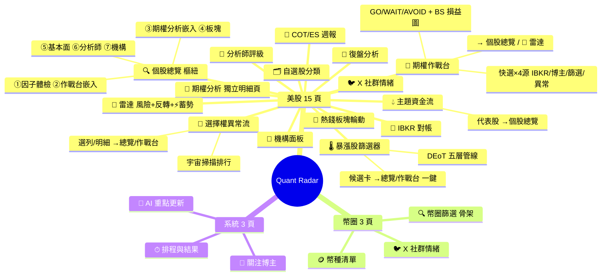
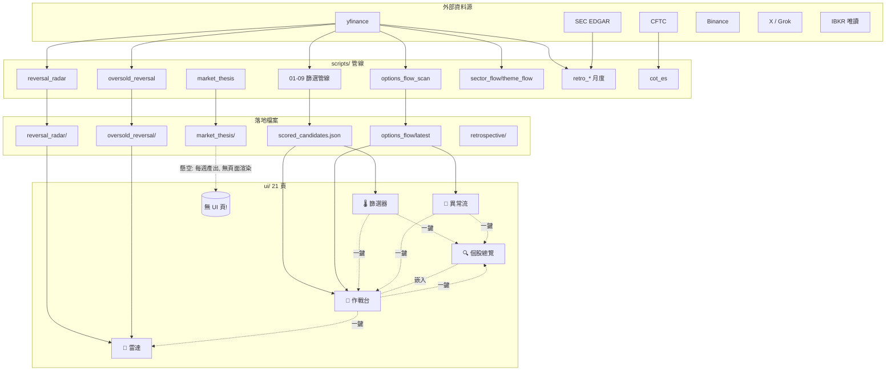
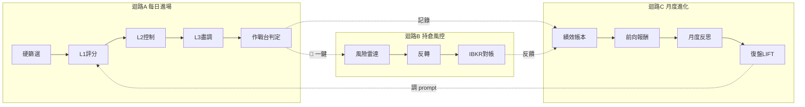

# Quant Radar 系統分析 v2 — 優化總覽 + 新全景

> **文件定位**：這是一份 **point-in-time 的優化檢視**（記錄「第一版外部 AI 分析 → 驗證修正 → 實作整併」這一輪做了什麼、為什麼）。
> 常駐、隨程式碼更新的**權威參考**是同目錄的 [`system_panorama.md`](system_panorama.md)（頁面地圖／資料流／路線圖）。兩者分工同原始的
> `system_analysis.md`（全景分析）與 `System Architecture Optimization Review.md`（優化檢視）。
> 截至 **2026-06-13**（整併已合併進 main `3ca1097`）；計數類資訊會過期。

---

# Part A — 這次優化了哪些（Optimization Review）

## A1. 一句話總結

第一版分析「方向大致對、但有錯漏」：頁面重疊矩陣正確，但**漏了近三週的新功能**、**沒抓到 4 支死碼**，且**首要建議與一條已鎖定的設計決策衝突**。這次做的是：**把分析修正成可執行的路線圖、實作低成本高效益的「串聯」快贏、清掉死碼**——全部經 Codex 對抗式 review 放行後合併。

## A2. 對第一版 8 項建議的最終裁決

| # | 第一版建議 | 最終裁決 | 為什麼 / 怎麼處理 |
|---|---|---|---|
| 2 | 候選→作戰台一鍵跳轉 | ✅ **已實作並合併** | 痛點最高、成本最低；複用既有 session 模式 |
| 5 | yfinance 統一快取 | ✅ 採納＋**升為 P1a** | 問題在 `scripts/` 層非 UI 層；6/8–10 有真實 rate-limit 停擺事故 → 資料穩定優先 |
| 1 | 期權分析合入作戰台 | ⛔ **不做（牴觸鎖定決策）** | `options_cockpit_roadmap.md`（2026-06-02）已鎖定期權分析為獨立「鏈微結構」明細頁。三頁混淆改用 Tab③ 嵌入＋跨頁跳轉緩解，不砍頁 |
| 4 | 壓縮基底併雷達 | 🔄 **只合 UI**（列 P1b） | 後端 cron / forward 驗證 harness **絕不合併**（驗證統計會互相污染）；只把 UI 併成雷達第三 tab |
| 3 | 統一個股入口 | 🔄 改為雙向串聯 | 個股總覽已是樞紐；全部塞進去會過重 |
| 6 | 異常流接 Dim6 評分 | ⛔ 暫緩 | 訊號接入評分前需 forward 驗證；Dim6 retro Phase-2 需累積 60d+（進行中） |
| 7 | 風險分嵌 IBKR 頁 | 🟡 P3 | 雷達已重用 risk_guard 函數，僅剩反向嵌入 |
| 8 | 板塊→主題鑽入 | 🟡 P3 | 無現成 11 ETF→35 籃子映射表，成本被低估 |

> 第一版**完全漏掉**的：大盤行情研判（market_thesis）pipeline 已上線但**無 UI 頁**（唯一懸空產出）、4 支死碼、IV 雙路徑 / 分析師三路徑 / 期權鏈解析雙實作、以及一串鎖定約束。

## A3. 這次實際做了什麼（已合併 main `3ca1097`）

### 串聯快贏（打通「發現→決策」斷裂）
- **跨頁一鍵跳轉**：暴漲股篩選器候選卡、選擇權異常流（排行選列＋個股明細）→ 一鍵帶代號進**個股總覽 / 期權作戰台**；作戰台再加 **📡 雷達** 一鍵（判定後接風控，消除死巷）。共 **7 個 `switch_page` 呼叫點**橫跨 4 頁。
- **作戰台候選快選擴充**：從 2 來源（IBKR / 博主雷達）擴成 **4 來源**（＋🌡今日篩選器 Top5 ＋🚨今日異常流 Top5）。當日無正式候選時 fallback 列最高分，但 **REJECT 明標 ❌「非推薦」**、附 scan_date，不偽裝成推薦。

### 衛生清理
- 刪 **4 支死碼**：`poc_free_sentiment.py`、`poc_sentiment_judgment.py`、`run_screen_batched.py`、`tv_webhook.py`（全部零引用；前三支被 `sentiment_free.py`/workflow 取代，tv_webhook 經使用者確認 TradingView 維持 display/webhook-only、無預留入口需求）。

### 文件
- 新增 `docs/system_panorama.md`（全景地圖／資料流／重疊矩陣／8 項裁決／P1–P3 路線圖含鎖定約束），並從 `USER_GUIDE.md`、`MASTER_OVERVIEW.md` 指向它。

## A4. 跨頁跳轉的工程教訓（Codex 連抓三次的 stale-state）

第一版只說「加跳轉按鈕」，但實作踩到 Streamlit 三個經典陷阱，每個都被 Codex stop-review 抓出並修掉：

1. **markdown 連結 ≠ 同 session 跳轉**：Streamlit 連結是 `target=_blank` → 開新分頁＝新 session，handoff 直接遺失。正解：app.py 註冊 `st.Page` 物件到 `_shared.PAGE_REGISTRY`，用 `st.switch_page` 同 session 切頁。
2. **有 key 的 widget 會無視 `value=`**：目標頁殘留的舊代號 / 批次模式會吃掉 handoff。正解：用**一次性 `checkup_handoff` / `radar_handoff` key**（來源寫、目標頁 pop），並在 widget 實例化**前**覆寫狀態（單一來源模式）。同代號重跳也能觸發（不靠值比對）。
3. **跳轉後殘留別頁結果**：雷達 handoff 換了代號卻沒清前次掃描 → 舊結果顯示在新代號下。正解：handoff 時連同清 `radar_risk/radar_rev/radar_detail_pick`，落在「按掃描」提示。

## A5. Codex 對抗式 review 軌跡（全數放行）

| 階段 | 發現 | 結果 |
|---|---|---|
| stop-review ×3 | 錯代號 handoff / 批次模式殘留 / 同代號被值比對吃掉 | 各自修復（`52e3cbe` / `5001021` / `5d85591`） |
| 全面 3-scope review | 1 MEDIUM（路線圖排序）＋ 3 LOW（嵌入計數、選列越界、作戰台死巷） | 全修（`6134c26`） |
| confirm r1 | 7 項 re-PASS；2 新 MEDIUM（雷達 stale-scan、P1b 牴觸鎖定決策） | 全修（`03d80b4`） |
| confirm r2 | 兩項 CLEARED | **SHIP（放行）** |
| 合併 | rebase --onto main 丟 3 個別軌祖先 commit → ff-only | main `7153fd7→3ca1097` |

---

# Part B — 新系統全景（修正後）

## B1. 頁面全景 mindmap（21 頁，實際 app.py 註冊；2026-06-15 P1b 後）

## B2. 資料流全景（sources → scripts → artifacts → UI）

> **唯一懸空產出**：`market_thesis.py` 每週寫 `reports/market_thesis/`，**無 UI 頁渲染** → 路線圖 P2。
> 虛線 = 本次新增的跨頁一鍵串聯（過去要手動切頁輸入代號）。

## B3. 三核心迴路 + 已打通的迴路間串聯

迴路本身健康；第一版正確指出「痛點在迴路間串聯」。本次以一鍵跳轉打通了 A→B（作戰台 📡 雷達）與發現→決策（篩選器/異常流 → 總覽/作戰台）。

## B4. 重疊矩陣（清理後仍存在的真實重複 → 路線圖標的）

| 重複項 | 狀態 | 路線圖 |
|---|---|---|
| yfinance 直呼 ×42 腳本 | 🔴 無統一快取（真實停擺事故） | **P1a** |
| 期權鏈解析 ×2（momentum_options / options_free） | 🟡 | P3 |
| 分析師抓取 ×3（02_llm_score 內嵌 / analyst_free / _shared） | 🟡 內嵌繞過快取 | P2 |
| IV 計算 ×2（iv_history / momentum_options 代理） | 🟡 | P2 |
| 情緒 POC | ✅ 已清（本次刪 2 支） | — |
| 死碼 ×4 | ✅ 已刪 | — |

**已統一、非重複**（第一版誤判處）：Black-Scholes（options_analytics 唯一源）、IV 快照（iv_history）、LLM 接口（llm_client）、磁碟快取（cache.py）、板塊 ETF 映射（_shared 6h）。

## B5. 優化路線圖（含鎖定約束）

**鎖定約束**（任何整合不得違反）：
1. PIT 軌（sp500_pit）與 root sp1500 不得合併
2. theme_flow 未過 Codex 確認輪前維持 UI-only、不接評分
3. market_thesis Tier-2 維持 gated（待 ablation 證明 lift）
4. retro Phase-2 結論需 ≥60d forward
5. **期權分析保留為獨立頁**（options_cockpit_roadmap 2026-06-02 鎖定）
6. IBKR 永遠唯讀；verified-data-to-AI 原則貫穿

**P1 — 資料穩定優先，再 UI 整併**
- **P1a** scripts 層 yfinance 統一快取（擴充 cache.py 或新建 `_yfinance.py`；先遷同日重複抓 SPY/VIX/sector ETF 的 01/02/07/retro）
- ✅ **P1b（已完成 2026-06-15）** 壓縮基底 → 雷達第三 tab「⚡ 蓄勢」（後端不動，頁數 22→21）

**P2 — 資料流品質**
- IV 計算收斂到 iv_history.py（單一真相源）
- 分析師三路徑統一走 analyst_free → cache
- market_thesis UI 頁（渲染每週 forecast + forward 驗證 + manifest 狀態）

**P3 — 體驗與長尾**
- 期權鏈解析統一 parser
- IBKR 對帳頁嵌風險分/反轉分
- 板塊→主題 parent/child 映射 + RRG 鑽入
- sector_rotation 加 drill-through（用既建好的 `_shared.switch_page`）

---

⚠️ 僅供訊號生成,非投資建議。
