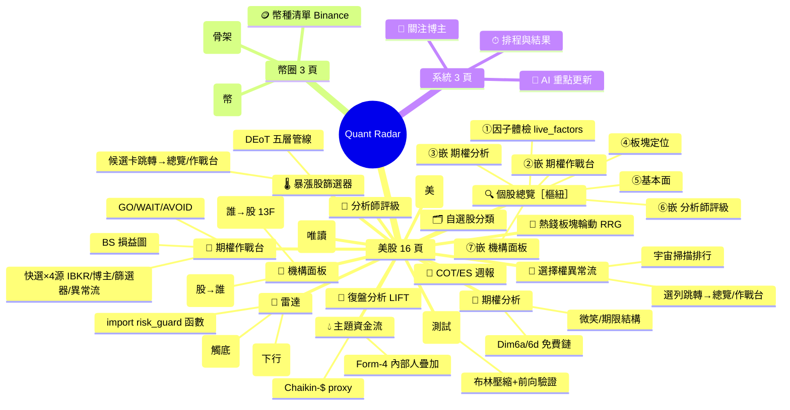
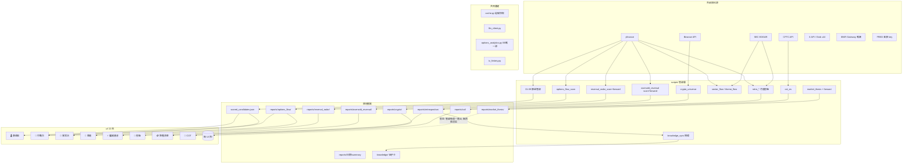
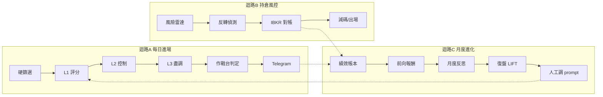

# Quant Radar 系統全景 — 功能地圖、資料流與優化路線圖

> **截至 2026-06-12**。本文件以實際 codebase 盤點為準（app.py 註冊頁面、scripts 引用關係、workflow 排程全數驗證），修正並取代外部 AI 分析的遺漏與錯誤。計數類資訊（頁面數、call sites）會隨開發過期，更新時請同步本標頭日期。

---

## 1. 頁面全景 mindmap（22 頁，依 app.py 實際註冊）

**嵌入關係**（不是重複，是樞紐設計）：個股總覽外部嵌入 4 個子視圖（②作戰台/③期權分析 via `render_for`、⑥分析師/⑦機構 via embedded render；①④⑤為本頁自有 facet）；機構面板以 segmented_control 包持股+持倉兩模組；雷達 import `risk_guard` 的函數重用（risk_guard.py 可獨立 render 但未註冊於 nav）。

---

## 2. 資料流全景（sources → scripts → artifacts → UI）

> [!WARNING]
> **唯一懸空產出**：`market_thesis.py` 每週一 23:00 UTC 寫 `reports/market_thesis/regime_only_forecast_*.json` + forward 驗證，但**沒有任何 UI 頁渲染它**（外部分析完全漏掉這條軌）。已列路線圖 P2。

---

## 3. 三核心迴路（驗證為健康的設計）

迴路本身健康；痛點在**迴路間串聯**（候選跨頁要手動輸入代號）——2026-06-12/13 已以跳轉按鈕打通：篩選器候選卡、異常流選列/明細 → **一鍵** `st.switch_page` 帶入個股總覽/作戰台（經 `_shared.PAGE_REGISTRY`，app.py 註冊頁面物件）。注意：舊的 markdown 相對連結模式已廢除——Streamlit 連結是 `target=_blank`，開新分頁=新 session，handoff 會遺失（Codex stop-review 抓到的缺陷，theme_flow 原始模式同病同修）。

---

## 4. 重疊矩陣（管線層真實重複，UI 嵌入不算）

| 重複項 | 路徑數 | 位置 | 狀態 |
|---|---|---|---|
| yfinance 直呼 | **42 個腳本** | 01_hard_filter、02_llm_score、07_verify、retro_*、reversal_*、各 *_free … | 🔴 無統一快取層；6/8-10 真實 rate-limit 事故（lane 停擺 3 天，被迫拆 cron）|
| 期權鏈解析 | ×2 | momentum_options.py / options_free.py 各自 parse | 🟡 |
| 分析師抓取 | ×3 | 02_llm_score 內嵌 / analyst_free(6h快取) / ui/_shared.load_analyst_views | 🟡 內嵌路徑繞過快取 |
| IV 計算 | ×2 | iv_history.iv_percentile / momentum_options._realized_vol_percentile | 🟡 後者為 <40 天的代理，概念重複 |
| RS/動能排名 | ×2 | sector_flow / theme_flow 各算 50/200d 動能 | 🟢 低影響 |
| 情緒 POC | 已清 | sentiment_free.py 為正典；兩支 POC 已刪（2026-06-12）| ✅ |

**已統一的**（外部分析誤判為重複）：BS 數學（options_analytics 唯一源）、IV 快照存取（iv_history）、LLM 接口（llm_client）、磁碟快取（cache.py，*_free 模組全走）、板塊 ETF 映射（_shared 6h 快取）。

---

## 5. 缺口清單

| 缺口 | 說明 |
|---|---|
| 大盤行情研判無 UI | 管線已上線（Tier-1 deterministic，Codex MKT-P1 放行），產出懸空 → P2 |
| 幣圈篩選為骨架 | 等 `data/crypto_scored.json` 管線 |
| sector_rotation 無 drill-through | theme_flow 有「點代表股→個股總覽」模式，板塊頁沒有 |
| FRED key 未接 | market_thesis manifest 維持 degraded，不發 Telegram |

## 6. 死碼清單

| 腳本 | 處置 |
|---|---|
| poc_free_sentiment.py / poc_sentiment_judgment.py | ✅ 已刪 2026-06-12（被 sentiment_free.py 取代）|
| run_screen_batched.py | ✅ 已刪 2026-06-12（被 workflow 取代）|
| tv_webhook.py | ✅ 已刪 2026-06-13（使用者確認不需要）— 零程式碼引用；TradingView 維持 display/webhook-only，無此預留入口需求 |

---

## 7. 對外部 AI 八項建議的裁決

| 原建議 | 裁決 | 理由與調整 |
|---|---|---|
| #2 候選→作戰台跳轉 | ✅ **已實作 2026-06-12** | theme_flow 模式直接複用 |
| #5 yfinance 統一快取 | ✅ 採納＋**升優先級** | 問題在 scripts/ 層非 ui 層；有真實事故 → P2 首位 |
| #1 期權分析合入作戰台 | ⛔ 牴觸鎖定決策 | `options_cockpit_roadmap.md`（2026-06-02）已鎖定：動能期權退役、**期權分析保留為獨立「鏈微結構」明細頁**。不退役其 nav。三頁混淆的痛點靠既有手段緩解：個股總覽 Tab③ 已 `render_for` 嵌入、本次跨頁跳轉串聯入口 → 重複感由導覽解決，非靠砍頁 |
| #4 壓縮基底併雷達 | 🔄 **只合 UI** | 後端 cron/forward harness 各自獨立（C-8b 剛修復），合併會污染驗證統計 → P1 |
| #3 統一個股入口 | 🔄 改雙向串聯 | 個股總覽已是樞紐；全收進去會過重 |
| #6 異常流接 Dim6 評分 | ⛔ 暫緩 | 訊號接入評分前需 forward 驗證；Dim6 retro Phase-2 需 60d+ 累積（進行中）|
| #7 風險分嵌 IBKR 頁 | 🟡 P3 | radar 已重用 risk_guard 函數，僅剩反向嵌入 |
| #8 板塊→主題鑽入 | 🟡 P3 | 無現成 11 ETF→35 籃子映射表，成本被低估 |

---

## 8. 優化路線圖

### 鎖定約束（任何整合不得違反）
1. **PIT 軌獨立**：sp500_pit 與 root sp1500 資料集不得合併（survivorship 修正）
2. **theme_flow 不接評分**：Codex TF-1 確認輪未完成前維持 UI-only
3. **market thesis Tier-2 維持 gated**：等 ablation 證明 lift
4. **retro Phase-2**：Dim3/Dim6 結論需 ≥60 天 forward 累積
5. **IBKR 永遠唯讀**；**verified-data-to-AI** 原則貫穿

### P1 — 資料穩定優先，再 UI 整併（Codex review 調序：先穩管線、後修導覽）
- **P1a · scripts 層 yfinance 統一快取**（資料穩定，最優先——有 6/8-10 真實停擺事故）：擴充 cache.py 或新建 `scripts/_yfinance.py`（process-level，TTL 5-15min）；42 call sites 漸進遷移，先遷同日重複抓 SPY/VIX/sector ETF 的大戶（01/02/07/retro）
- **P1b · 壓縮基底 → 雷達第三 tab「蓄勢」**：渲染 `reports/oversold_reversal/latest.json`，獨立頁退役；**後端 cron/forward/validation 完全不動**。頁面 22→21
- **（不做）期權分析 nav 退役**：`options_cockpit_roadmap.md`（2026-06-02）鎖定期權分析為獨立明細頁，**不退役**。若未來確要再整併，須先明確 supersede 該決策；目前只在期權分析頁補一個「← 回作戰台」反向連結即可，不動 nav

### P2 — 資料流品質
- **IV 計算收斂**：momentum_options 的 realized-vol 代理併入 iv_history.py，單一真相源
- **分析師三路徑統一**：02_llm_score 內嵌抓取改走 analyst_free → cache
- **market_thesis UI 頁**：渲染每週 forecast + forward 驗證 + manifest 狀態

### P3 — 體驗與長尾
- 期權鏈解析統一 parser（momentum_options + options_free 共用）
- IBKR 對帳頁嵌風險分/反轉分；作戰台→IBKR 對帳 CTA（對帳頁為組合層級、無單檔入口，需先定義落點——Codex UX review 標記）
- 板塊→主題 parent/child 映射表 + RRG 鑽入
- sector_rotation 加 drill-through 按鈕（用 `_shared.switch_page`，✅ registry 已於 2026-06-13 建好）

---

⚠️ 僅供訊號生成,非投資建議。
